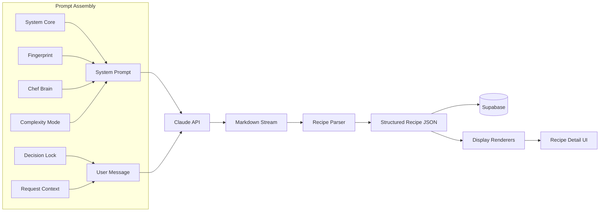
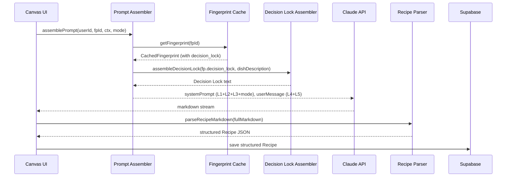

# Design Document: Constraint-First Prompting

## Overview

This design introduces a Decision Lock mechanism that transforms chef fingerprints from passive stylistic guidance into active architectural constraints. The core insight: injecting fingerprint-derived questions into the **user message** (not the system prompt) forces the model to reason through chef-specific decisions before generating any recipe content. This prevents the model from pattern-matching to generic dish archetypes and instead produces structurally distinct recipes per fingerprint.

The feature spans five interconnected changes:

1. **Decision Lock injection** — a new prompt layer (Layer 4 in a 5-layer architecture) that prepends binding constraint questions to the user message
2. **Recipe output parsing** — a markdown-to-structured-JSON parser that replaces the current raw-markdown storage pattern
3. **Structured recipe display** — rendering saved recipes from parsed JSON via display renderers instead of raw markdown
4. **Recipe detail UI redesign** — component cards, structured flavour architecture, visual timeline, Decision Lock answer panel
5. **Type system and cache updates** — `DecisionLockQuestion`, `decision_lock_answers` on Recipe, 5-layer `AssembledPrompt`



## Architecture

### 5-Layer Prompt Architecture

The current 4-layer architecture (System Core → Fingerprint → Chef Brain → Request Context) becomes a 5-layer model. The key change: the Decision Lock occupies a new layer between Chef Brain and Request Context, and both Decision Lock and Request Context are placed in the **user message** rather than the system prompt.

| Layer | Name | Location | Source |
|-------|------|----------|--------|
| 1 | System Core | System prompt | `system-core.ts` (static) |
| 2 | Fingerprint | System prompt | `fingerprint-cache.ts` → `fingerprint-loader.ts` |
| 3 | Chef Brain | System prompt | `brain-compiler.ts` (Redis-cached) |
| — | Complexity Mode | System prompt (appended) | `complexity-modes.ts` |
| 4 | Decision Lock | User message (first) | `fingerprint-cache.ts` → new `decision-lock-assembler.ts` |
| 5 | Request Context | User message (after DL) | UI state (dish, occasion, mood, etc.) |



### Recipe Parsing Pipeline

Currently, the canvas page (`canvas/page.tsx`) streams markdown from `/api/generate`, then calls `/api/parse-recipe` to parse it. The save-recipe route (`save-recipe/route.ts`) stores raw markdown in `dev_notes` with empty placeholder objects for all structured fields. Meanwhile, `recipe-store.ts` has a `storeRecipeWithSnapshot()` function that persists fully structured Recipe JSON with a PromptSnapshot — but it's not being used by the canvas flow.

The new pipeline unifies these paths:

1. Client accumulates the full markdown stream (existing behaviour)
2. Client calls a new `parseRecipeMarkdown()` pure function (replaces the `/api/parse-recipe` API call) that extracts structured fields using section-aware regex parsing
3. Client sends the parsed structured JSON + PromptSnapshot to the save flow
4. Save uses `storeRecipeWithSnapshot()` from `recipe-store.ts` to persist fully populated structured fields
5. Raw markdown is preserved in `dev_notes` as a fallback/audit trail

The parser is a **client-side pure function** — no API call needed. It operates on the complete markdown string after streaming finishes. This replaces the current `/api/parse-recipe` endpoint.

### Integration with Existing Recipe Ecosystem

The parsed structured Recipe JSON must be compatible with all existing modules that operate on `Recipe`:

- **`recipe-store.ts`** — `storeRecipeWithSnapshot()` already persists structured Recipe JSON with PromptSnapshot. The canvas flow should use this instead of the raw `save-recipe` route. The PromptSnapshot now includes the `decisionLock` layer.
- **`version-store.ts`** — `createVersion()` stores full `Recipe` + `PromptSnapshot` per version. Decision Lock answers are preserved in each version's `recipeData`. `diffVersions()` already compares components, flavour, and thinking — no changes needed since `decision_lock_answers` is additive metadata.
- **`dial.ts`** — `dialRecipe()` sends the full source Recipe JSON to the AI for evolution. The Decision Lock answers from the source recipe provide context for the dial. The `buildPromptSnapshot()` call in dial already captures the assembled prompt — it will now include the `decisionLock` layer automatically.
- **`batch-scaler.ts`** — `scaleRecipe()` operates on `components[].ingredients[].amount`. No changes needed — Decision Lock answers are metadata, not scaled.
- **`export-service.ts`** — `exportRecipeAsPdf()` and `exportRecipeAsMarkdown()` render from structured Recipe JSON. They should include Decision Lock answers when present (similar to the display renderer updates).
- **`zod-schemas.ts`** — `RecipeSchema` validates AI-generated Recipe JSON. Must add `DecisionLockAnswerSchema` and optional `decision_lock_answers` field. `PromptSnapshotSchema` must add `decisionLock` layer.
- **`csv-chef-parser.ts`** — `parseChefCSV()` and `exportChefCSV()` handle chef profile import/export. Must add `decision_lock` section support so Decision Lock questions can be authored and imported via CSV alongside the rest of the fingerprint.
- **`library/actions.ts`** — `saveRecipe()` already persists structured Recipe JSON. The `RecipeRow` type needs `decision_lock_answers` added. `getRecipes()` and `searchRecipes()` return full rows — no changes needed.

### Recipe Detail Rendering

Currently, `recipe-detail-client.tsx` passes the DB row through `rowToRecipe()` and renders via `DisplayModeSwitcher`, which calls the display renderers. The renderers already operate on structured `Recipe` JSON. The problem is that saved recipes have empty structured fields and the actual content lives in `dev_notes` as raw markdown.

Once the parser populates the structured fields at save time, the existing display renderers work correctly without modification (except for adding Decision Lock answer support to `renderFullRecipe` and `renderRiff`).

For legacy recipes (saved before this feature), the detail view falls back to rendering raw markdown from `dev_notes` when structured fields are empty.

## Components and Interfaces

### New Modules

#### `src/lib/decision-lock-assembler.ts`

Assembles the Decision Lock text block from a fingerprint's `decision_lock` template.

```typescript
export interface DecisionLockQuestion {
  question: string;
  constraint_source: string;
}

export interface AssembledDecisionLock {
  text: string;
  questionCount: number;
  tokenEstimate: number;
}

/**
 * Assembles Decision Lock text for injection into the user message.
 * Returns empty result if no decision_lock questions exist.
 */
export function assembleDecisionLock(
  questions: DecisionLockQuestion[] | undefined,
  dishDescription: string
): AssembledDecisionLock;
```

The assembled text follows this structure:
```
DECISION LOCK — Answer each question below before generating the recipe.
Your answers are BINDING. The recipe MUST reflect every answer.
Where your answers conflict with generic conventions for this dish, your answers take precedence.

For: [dishDescription]

1. [question text]
2. [question text]
...

After answering all questions, generate the recipe.
```

#### `src/lib/recipe-parser.ts`

Parses AI-generated markdown into structured Recipe JSON fields.

```typescript
export interface ParsedRecipe {
  title: string;
  thinking: { approach: string; architecture: string; pattern: string };
  flavour: ParsedFlavour;
  components: ParsedComponent[];
  timeline: ParsedTimelineStage[];
  variations: ParsedVariations;
  decisionLockAnswers?: Array<{ question: string; answer: string }>;
}

export interface ParseResult {
  recipe: ParsedRecipe;
  warnings: string[];  // fields that failed to parse
}

/**
 * Parses complete AI markdown output into structured Recipe fields.
 * Extracts Decision Lock answers if present.
 * Never throws — returns partial data with warnings on parse failures.
 */
export function parseRecipeMarkdown(markdown: string): ParseResult;
```

### Modified Modules

#### `src/lib/prompt-assembler.ts`

- Import and call `assembleDecisionLock()` during prompt assembly
- Add `decisionLock: PromptLayer` to the `layers` object in `AssembledPrompt`
- Place Decision Lock text before request context in the user message
- Log Decision Lock token count alongside fingerprint token count
- Update `buildPromptSnapshot()` to capture the Decision Lock layer

#### `src/lib/fingerprint-cache.ts`

- No schema changes needed — `decision_lock` is already part of `full_profile` JSONB and flows through as part of `ChefProfile`
- The `CachedFingerprint.fullProfile` field already contains the full `ChefProfile`, which will now include the optional `decision_lock` array

#### `src/lib/display-renderers/index.ts`

- `renderFullRecipe()`: add Decision Lock section after The Thinking section when `recipe.decision_lock_answers` exists
- `renderRiff()`: include Decision Lock answers in the architecture overview
- Other renderers: no changes (they omit Decision Lock to stay focused)

#### `src/app/api/save-recipe/route.ts`

- Accept fully parsed structured Recipe JSON from the client
- Persist populated `intent`, `flavour`, `components`, `timeline`, `variations`, `thinking`, and `decision_lock_answers` fields
- Keep `dev_notes` for the raw markdown as a fallback/audit trail

#### `src/app/(studio)/library/[id]/recipe-detail-client.tsx`

- Redesign the layout with component cards, structured flavour architecture display, visual timeline
- Add collapsible Decision Lock answers panel
- Fall back to raw markdown rendering for legacy recipes (where structured fields are empty)

#### `src/lib/types/recipe.ts`

- Add `DecisionLockQuestion` interface
- Add optional `decision_lock_answers` to `Recipe`
- Add `decisionLock: PromptLayer` to `AssembledPrompt.layers`
- Add `decisionLock: PromptLayer` to `PromptSnapshot`

#### `src/lib/types/fingerprint-profile.ts`

- Add optional `decision_lock: DecisionLockQuestion[]` to `ChefProfile`

#### `src/lib/zod-schemas.ts`

- Add `DecisionLockQuestionSchema` and `DecisionLockAnswerSchema`
- Add optional `decision_lock_answers` to `RecipeSchema`
- Add optional `decisionLock` to `PromptSnapshotSchema`

#### `src/lib/system-core.ts`

- Update the output format instructions to include a `## Decision Lock Answers` section placeholder (only output when Decision Lock questions were provided)

#### `src/lib/recipe-store.ts`

- `storeRecipeWithSnapshot()` already persists structured Recipe JSON — no interface changes needed
- The `PromptSnapshot` parameter now includes the `decisionLock` layer, which flows through automatically
- The canvas flow should use this function instead of the raw `save-recipe` route for new recipes

#### `src/lib/version-store.ts`

- `RecipeVersion.recipeData` already stores full `Recipe` — `decision_lock_answers` flows through automatically
- `RecipeVersion.promptSnapshot` already stores full `PromptSnapshot` — `decisionLock` layer flows through automatically
- `diffVersions()` — no changes needed; Decision Lock answers are additive metadata, not structural recipe data
- `VersionHistoryEntry` — no changes needed; dial direction and fingerprint metadata are already captured

#### `src/lib/dial.ts`

- `dialRecipe()` sends source Recipe JSON to the AI — `decision_lock_answers` from the source recipe provides context for evolution
- The `assemblePrompt()` call already returns the updated `AssembledPrompt` with `decisionLock` layer
- The `buildPromptSnapshot()` call captures the `decisionLock` layer automatically
- `rowToRecipe()` helper must map `decision_lock_answers` from the DB row

#### `src/lib/batch-scaler.ts`

- No changes needed — `scaleRecipe()` operates on `components[].ingredients[].amount` only
- Decision Lock answers are metadata, not ingredient quantities

#### `src/lib/export-service.ts`

- `exportRecipeAsPdf()` — add Decision Lock answers section in the HTML output when `recipe.decision_lock_answers` exists, rendered as a Q&A list before the components
- `exportRecipeAsMarkdown()` — uses `renderFullRecipe()` which will include Decision Lock answers after the display renderer update

#### `src/lib/csv-chef-parser.ts`

- `parseChefCSV()` — add `decision_lock` section parsing: rows with `section=decision_lock`, `key=question` and `key=constraint_source` grouped into `DecisionLockQuestion` objects
- `exportChefCSV()` — add `decision_lock` section export: emit `decision_lock,question,[text]` and `decision_lock,constraint_source,[ref]` rows for each question

#### `src/app/(studio)/canvas/page.tsx`

- Replace the `/api/parse-recipe` fetch call with a direct call to the client-side `parseRecipeMarkdown()` function
- After parsing, call the save flow with the structured Recipe JSON + PromptSnapshot (via a server action or the existing `saveRecipe()` from `library/actions.ts`)
- The `recipe` state already holds a `Recipe` object — the parser output maps directly to this

#### `src/app/(studio)/library/actions.ts`

- `RecipeRow` type — add optional `decision_lock_answers` field
- `saveRecipe()` — add `decision_lock_answers` to the insert payload
- `rowToRecipe()` helper in `recipe-detail-client.tsx` — map `decision_lock_answers` from the DB row

## Data Models

### DecisionLockQuestion

```typescript
interface DecisionLockQuestion {
  question: string;           // e.g. "What is your acid architecture for this dish?"
  constraint_source: string;  // e.g. "identity_core.signature_moves" or "negative_constraints.avoid[0]"
}
```

Stored in `ChefProfile.decision_lock` (optional array, 4–8 items per fingerprint).

### DecisionLockAnswer

```typescript
interface DecisionLockAnswer {
  question: string;  // echoed from the template
  answer: string;    // model's binding answer
}
```

Stored in `Recipe.decision_lock_answers` (optional array).

### Updated AssembledPrompt

```typescript
interface AssembledPrompt {
  systemPrompt: string;
  userMessage: string;
  layers: {
    systemCore: PromptLayer;
    fingerprint: PromptLayer;
    chefBrain: PromptLayer;
    decisionLock: PromptLayer;      // NEW
    requestContext: PromptLayer;
  };
}
```

### Updated PromptSnapshot

```typescript
interface PromptSnapshot {
  systemCore: PromptLayer;
  fingerprint: PromptLayer & { fingerprintId: string; fingerprintName: string };
  chefBrain: PromptLayer & { userId: string };
  decisionLock: PromptLayer;        // NEW
  requestContext: PromptLayer;
  totalInputTokens: number;
  totalOutputTokens: number;
  estimatedCost: number;
  assembledAt: string;
}
```

### Updated ChefProfile (fingerprint-profile.ts)

```typescript
interface ChefProfile {
  identity_core: IdentityCore;
  negative_constraints: NegativeConstraints;
  techniques: TechniqueSection[];
  ingredient_lexicon: IngredientSection[];
  dish_exemplars: DishExemplar[];
  voice: VoiceLayer;
  seasonal_filters: SeasonalFilter[];
  decision_lock?: DecisionLockQuestion[];  // NEW — optional, 4-8 questions
}
```

### Recipe Parser Output Mapping

The parser maps markdown sections to structured fields:

| Markdown Section | Target Field | Strategy |
|-----------------|--------------|----------|
| `# [Title]` | `title` | First H1 heading |
| `## Decision Lock Answers` | `decision_lock_answers` | Numbered Q&A pairs |
| `## The Thinking` | `thinking` | Key-value extraction (Approach, Architecture, Pattern) |
| `## Flavour Architecture` | `flavour` | Key-value + nested list extraction |
| `## Components / ### [Name]` | `components[]` | Per-component: ingredients list, method steps, doneness cues |
| `## Variations` | `variations` | Bullet list extraction |
| `## Timeline` | `timeline` | Table row extraction |

Each ingredient line is parsed from the format:
```
- [amount][unit] [name] — [function] *([prep note])*
```

Each step line is parsed from the format:
```
1. [instruction] ([timing]) — *Why: [technique reason]* — *Season: [seasoning note]*
```

### CSV Chef Profile Format for Decision Lock

The `csv-chef-parser.ts` import/export adds a `decision_lock` section. Each question is a pair of rows:

```csv
section,key,value
decision_lock,question,"What is your acid architecture for this dish — what acid, when does it enter, and what structural role does it play?"
decision_lock,constraint_source,identity_core.signature_moves
decision_lock,question,"What fat are you using and how are you developing it — what flavour does the fat carry?"
decision_lock,constraint_source,techniques[0].approach
```

Questions and constraint_sources are paired sequentially — the first `constraint_source` after a `question` belongs to that question.

