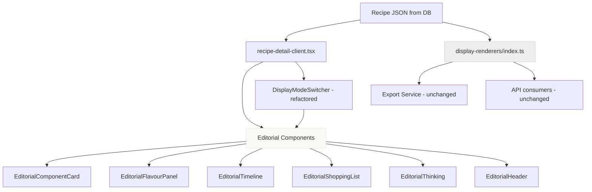

# Design Document: Editorial Recipe Display

## Overview

This feature transforms the recipe display from utilitarian markdown/text rendering into a Scandinavian luxury editorial experience. The current system uses 7 pure-function renderers (`src/lib/display-renderers/index.ts`) that output markdown strings, displayed in `whitespace-pre-wrap` divs via `DisplayModeSwitcher`. The new system replaces this with structured React components that render recipe data directly from the `Recipe` type, using an editorial design system of near-black on white, Helvetica, hairline borders, and generous whitespace.

The approach is:
1. Add editorial CSS custom properties to `globals.css` (colour, typography, spacing tokens)
2. Create a new `src/components/editorial/` directory with focused React components for each recipe section
3. Refactor `recipe-detail-client.tsx` to use editorial components instead of inline Tailwind markup
4. Refactor `DisplayModeSwitcher` to render editorial React components instead of markdown strings
5. Refactor the library page grid to use editorial card styling
6. Add CSS-based animations (no new dependencies — CSS transitions and `@keyframes` are sufficient; framer-motion is not in the project and not needed)

The existing pure-function renderers in `display-renderers/index.ts` are preserved as-is for non-UI consumers (export, API). The editorial components read from the same `Recipe` type but render structured JSX instead of markdown strings.

## Architecture

### Strategy: New Editorial Components Alongside Existing Code

Rather than refactoring the 7 string-based renderers (which serve export and non-UI paths), we create a parallel set of React components that consume the same `Recipe` data. The `DisplayModeSwitcher` is refactored to render these components instead of dumping markdown into a `whitespace-pre-wrap` div.



### File Changes Summary

| File | Action | Description |
|------|--------|-------------|
| `src/app/globals.css` | Modify | Add editorial CSS custom properties and typography rules |
| `src/components/editorial/editorial-header.tsx` | Create | Recipe title, metadata, sticky scroll header |
| `src/components/editorial/editorial-component-card.tsx` | Create | Ingredient list + numbered steps + doneness cues |
| `src/components/editorial/editorial-flavour-panel.tsx` | Create | Flavour architecture breakdown |
| `src/components/editorial/editorial-timeline.tsx` | Create | Linear timeline with stages |
| `src/components/editorial/editorial-shopping-list.tsx` | Create | Store-section grouped shopping list |
| `src/components/editorial/editorial-section.tsx` | Create | Shared section wrapper with heading style + scroll animation |
| `src/components/editorial/editorial-thinking.tsx` | Create | The Thinking panel |
| `src/components/editorial/editorial-variations.tsx` | Create | Variations display |
| `src/components/editorial/editorial-brief.tsx` | Create | Brief mode view |
| `src/components/editorial/editorial-cook-mode.tsx` | Create | Cook mode with stage navigation |
| `src/components/editorial/editorial-riff.tsx` | Create | Riff mode view |
| `src/components/editorial/index.ts` | Create | Barrel export |
| `src/components/display-mode-switcher.tsx` | Modify | Render editorial components instead of markdown strings |
| `src/app/(studio)/library/[id]/recipe-detail-client.tsx` | Modify | Use editorial components, single-column layout, remove sidebar |
| `src/app/(studio)/library/page.tsx` | Modify | Editorial card grid, search input, tag filters |
| `src/app/(studio)/layout.tsx` | Modify | Remove dark mode background from studio shell |

### Animation Approach: CSS Only

The project does not include framer-motion. CSS transitions and `@keyframes` are sufficient for all required animations:
- Fade-up on scroll: `IntersectionObserver` + CSS class toggle
- Cross-fade on mode switch: CSS `opacity` transition on a wrapper
- Slide on cook mode stage change: CSS `transform: translateX()` transition
- Collapsible height: CSS `grid-template-rows: 0fr → 1fr` transition (no JS height calculation)
- Hover opacity: CSS `transition: opacity 150ms`
- Strikethrough animation: CSS `transition: opacity 200ms, text-decoration 200ms`

The `IntersectionObserver` logic for scroll-triggered fade-up will live in `editorial-section.tsx` as a small custom hook (`useScrollReveal`).


## Components and Interfaces

### 1. Editorial Design Tokens (`globals.css` additions)

New CSS custom properties scoped under `:root`, extending the existing file:

```css
/* Editorial Design System Tokens */
:root {
  --ed-bg: #FFFFFF;
  --ed-bg-warm: #FAFAF8;
  --ed-text-primary: #0A0A0A;
  --ed-text-secondary: #888888;
  --ed-text-muted: #BBBBBB;
  --ed-border: #E5E5E5;
  --ed-font: "Helvetica Neue", Helvetica, Arial, sans-serif;
  --ed-spacing-section: 64px;
  --ed-spacing-subsection: 24px;
  --ed-content-width: 680px;
}
```

Typography rules applied to `.editorial` scoping class:

```css
.editorial {
  font-family: var(--ed-font);
  color: var(--ed-text-primary);
  background: var(--ed-bg);
}
.editorial * { border-radius: 0; box-shadow: none; }
```

### 2. EditorialSection (`editorial-section.tsx`)

Shared wrapper for major recipe sections. Provides:
- Section heading: uppercase, letter-spaced, 11–12px, font-weight 700, `--ed-text-muted`
- Vertical spacing: `--ed-spacing-section` margin-top
- Optional hairline divider above
- Scroll-reveal animation via `IntersectionObserver`

```typescript
interface EditorialSectionProps {
  label: string;           // e.g. "FLAVOUR ARCHITECTURE"
  showDivider?: boolean;   // hairline border-top, default true
  children: React.ReactNode;
}
```

The `useScrollReveal` hook:
```typescript
function useScrollReveal(): React.RefObject<HTMLDivElement> {
  // Returns a ref to attach to the section wrapper
  // On intersection (threshold 0.1), adds class 'ed-visible'
  // CSS handles: .ed-reveal { opacity: 0; transform: translateY(12px); }
  //              .ed-visible { opacity: 1; transform: translateY(0); transition: all 300ms ease-out; }
}
```

### 3. EditorialHeader (`editorial-header.tsx`)

Recipe title and metadata bar. Also manages the sticky scroll header.

```typescript
interface EditorialHeaderProps {
  title: string;
  subtitle?: string;
  occasion?: string;
  mood?: string;
  effort?: string;
  totalTime?: number;
  season?: string;
  cooked: boolean;
  onMarkCooked: () => void;
  onDelete: () => void;
}
```

Behaviour:
- Title: font-weight 300, 48px, letter-spacing -0.02em
- Metadata line: `occasion · mood · effort · time min` in `--ed-text-secondary`
- Sticky header: appears when main title scrolls out of viewport (tracked via `IntersectionObserver`). Renders title in 14px `--ed-text-secondary` with a bottom hairline border. Uses CSS `position: sticky; top: 0`.
- Action buttons (Mark Cooked, Delete): text-only, `--ed-text-muted`, opacity hover

### 4. EditorialComponentCard (`editorial-component-card.tsx`)

Renders a single recipe `Component` (sauce, base, garnish, etc.).

```typescript
interface EditorialComponentCardProps {
  component: Component;
}
```

Layout:
- Component name: font-weight 700, 20–24px
- Role: below name, `--ed-text-muted`, lowercase
- Prep-ahead note: `--ed-text-muted`, below heading
- Ingredients: each on own line. Amount+unit in font-weight 700, name in 400, function in `--ed-text-muted` italic after em-dash
- Steps: numbered paragraphs. Step number in `--ed-text-muted`, 24–32px, font-weight 300, positioned left. Instruction text beside it. Timing inline in `--ed-text-secondary`. Technique note below in `--ed-text-muted` italic.
- Doneness cues: block at end with left hairline border, `--ed-text-secondary`

### 5. EditorialFlavourPanel (`editorial-flavour-panel.tsx`)

```typescript
interface EditorialFlavourPanelProps {
  flavour: FlavourArchitecture;
}
```

Layout:
- Dominant element: font-weight 300, 32–40px
- Flavour profile: horizontal words separated by interpuncts, `--ed-text-secondary`
- Acid/Fat/Heat/Sweetness/Umami: vertical rows, label uppercase `--ed-text-muted` fixed-width left column, description in `--ed-text-primary`
- Texture contrasts: pairs with → separator, `--ed-text-secondary`
- Balance note: italic, `--ed-text-secondary`
- The Move: font-weight 700, `--ed-text-primary`, hairline top border above

### 6. EditorialTimeline (`editorial-timeline.tsx`)

```typescript
interface EditorialTimelineProps {
  timeline: Timeline;
}
```

Layout:
- Total duration + serve time at top in `--ed-text-secondary`
- Each stage: time range in font-weight 700 (left, fixed width), description in font-weight 400 (right)
- Passive stages: "(passive)" appended in `--ed-text-muted`
- Parallel tasks: indented with "↳" prefix in `--ed-text-muted`
- Hairline borders between stages, no table styling

### 7. EditorialShoppingList (`editorial-shopping-list.tsx`)

```typescript
interface EditorialShoppingListProps {
  shoppingList: ShoppingList;
}
```

Layout:
- Quality highlight at top: italic, `--ed-text-primary`, no background
- Section headings: uppercase, letter-spaced, `--ed-text-muted`
- Items: amount+unit font-weight 700, name font-weight 400
- Pantry items: `--ed-text-muted` with strikethrough
- Hairline borders between sections only

### 8. EditorialThinking (`editorial-thinking.tsx`)

```typescript
interface EditorialThinkingProps {
  thinking: Thinking;
}
```

Renders origin, architecture_logic, the_pattern, fingerprint_note as paragraphs with labels in `--ed-text-muted`.

### 9. EditorialBrief, EditorialCookMode, EditorialRiff

Mode-specific views that compose the above components:
- `EditorialBrief`: compact single-screen — title, metadata, ingredients inline, steps condensed
- `EditorialCookMode`: single component at a time with stage navigation (slide animation between stages)
- `EditorialRiff`: thinking + flavour + technique direction without amounts

### 10. Refactored DisplayModeSwitcher

The existing `DisplayModeSwitcher` is modified to:
- Replace pill-style tabs with plain text labels, active tab underlined
- Animate underline position on tab switch (CSS `transition: left, width`)
- Render editorial components per mode instead of markdown strings
- Cross-fade between views using CSS opacity transition on a wrapper div
- Cook mode: slide transition via CSS `transform: translateX()`

```typescript
// Mode rendering map (replaces markdown string rendering)
const MODE_RENDERERS: Record<DisplayMode, (recipe: Recipe, stage?: number) => JSX.Element> = {
  full: (r) => <EditorialFullView recipe={r} />,
  brief: (r) => <EditorialBrief recipe={r} />,
  cook: (r, stage) => <EditorialCookMode recipe={r} currentStage={stage ?? 0} />,
  'flavour-map': (r) => <EditorialFlavourPanel flavour={r.flavour} />,
  shopping: (r) => <EditorialShoppingList shoppingList={r.shopping_list} />,
  timeline: (r) => <EditorialTimeline timeline={r.timeline} />,
  riff: (r) => <EditorialRiff recipe={r} />,
};
```

### 11. Recipe Library Page Changes

The library page (`src/app/(studio)/library/page.tsx`) is updated:
- Recipe cards: zero border-radius, zero shadow, hairline border, hover border darkens to `--ed-text-primary`
- Title: font-weight 700, 14–16px
- Metadata: `--ed-text-muted`, 11–12px, no coloured badges
- Search input: no border-radius, bottom hairline border only, focus changes border to `--ed-text-primary`
- Tag filters: plain text with interpuncts, active tag in font-weight 700 `--ed-text-primary`, inactive in `--ed-text-muted`

## Data Models

No new data models are introduced. All editorial components consume the existing types from `src/lib/types/recipe.ts`:

- `Recipe` — top-level, passed to the detail page and display mode switcher
- `Component` — passed to `EditorialComponentCard`
- `FlavourArchitecture` — passed to `EditorialFlavourPanel`
- `Timeline` — passed to `EditorialTimeline`
- `ShoppingList` — passed to `EditorialShoppingList`
- `Thinking` — passed to `EditorialThinking`
- `Intent` — destructured in `EditorialHeader` for metadata display

The `ShoppingListView` type (used by the existing `renderShoppingList` function) is not used by the editorial shopping list component — it reads from `Recipe.shopping_list` (the `ShoppingList` type) directly, which already has `grouped_by_section`, `pantry_assumed`, and `the_one_thing`.

The `rowToRecipe` function in `recipe-detail-client.tsx` already maps DB rows to the `Recipe` interface and will continue to serve this role.


## Correctness Properties

*A property is a characteristic or behavior that should hold true across all valid executions of a system — essentially, a formal statement about what the system should do. Properties serve as the bridge between human-readable specifications and machine-verifiable correctness guarantees.*

### Property 1: Metadata renders as interpunct-separated plain text

*For any* valid `Intent` data (with any combination of occasion, mood, effort, time, and season values), the `EditorialHeader` component SHALL render the metadata as a single text node containing interpunct (·) separators between values, and the rendered output SHALL NOT contain any elements with badge, pill, or coloured background styling.

**Validates: Requirements 2.2**

### Property 2: Component card renders all present data fields

*For any* valid `Component` with a random set of ingredients (each with or without function text), steps (each with or without timing and technique_note), a doneness_description, and prep-ahead data, the `EditorialComponentCard` SHALL:
- Render the component name and role (role in lowercase)
- Render every ingredient's amount, unit, and name; render function text after an em-dash when present
- Render every step's sequence number and instruction; render timing inline when present; render technique_note as a separate element when present
- Render the doneness description block when non-empty
- Render prep-ahead notes when `can_prep_ahead` is true and `prep_ahead_notes` is non-empty

**Validates: Requirements 3.1, 3.2, 3.3, 3.4, 3.5, 3.6, 3.7, 3.8**

### Property 3: Flavour panel renders all present profile sections

*For any* valid `FlavourArchitecture` with a random dominant_element, flavour_profile array, and varying present/absent acid, fat, heat, sweetness, and umami profiles, texture_contrasts, balance_note, and the_move, the `EditorialFlavourPanel` SHALL:
- Render the dominant_element text
- Render flavour_profile items separated by interpuncts with no pill/badge elements
- Render a row for each profile where `present` is true (or where the profile has data)
- Render texture contrasts with → separator when present
- Render balance_note in italic when non-empty
- Render the_move in bold with a top border when non-empty

**Validates: Requirements 4.1, 4.2, 4.3, 4.4, 4.5, 4.6**

### Property 4: Shopping list renders sections, items, and pantry strikethroughs correctly

*For any* valid `ShoppingList` with random sections, items, pantry_assumed list, and the_one_thing, the `EditorialShoppingList` SHALL:
- Render the_one_thing as italic text at the top with no coloured background
- Render each section heading in uppercase
- Render each item with amount in bold and name in normal weight
- Apply strikethrough styling to items whose ingredient_name appears in pantry_assumed

**Validates: Requirements 5.1, 5.2, 5.3, 5.4**

### Property 5: Timeline renders stages with correct indicators

*For any* valid `Timeline` with random stages (varying is_passive and parallel configurations), the `EditorialTimeline` SHALL:
- Render total_duration_minutes at the top
- Render each stage's label and duration
- Append "(passive)" text for stages where is_passive is true
- Render parallel notes with "↳" prefix when parallel_notes is non-empty

**Validates: Requirements 6.1, 6.2, 6.3, 6.4**

### Property 6: Library recipe cards contain no coloured badge elements

*For any* recipe data with random combinations of fingerprint_id, complexity_mode, cooked status, and tags, the library page recipe card SHALL render all metadata as plain text using only `--ed-text-muted` or `--ed-text-secondary` styling, with no elements having coloured background classes (no `bg-purple-*`, `bg-green-*`, `bg-blue-*`, etc.).

**Validates: Requirements 8.4**

### Property 7: Library tag filters render as interpunct-separated text with correct active styling

*For any* array of tag strings and any single active tag from that array, the tag filter UI SHALL render tags separated by interpuncts where the active tag has font-weight 700 and `--ed-text-primary` colour, and all inactive tags have `--ed-text-muted` colour, with no pill backgrounds on any tag.

**Validates: Requirements 8.7**

### Property 8: All display modes render editorial components, not markdown strings

*For any* valid `Recipe` with structured data and *for any* of the 7 display modes (full, brief, cook, flavour-map, shopping, timeline, riff), the `DisplayModeSwitcher` SHALL render React component output that does NOT contain a `whitespace-pre-wrap` styled wrapper div with raw markdown text content.

**Validates: Requirements 9.4, 9.5**

## Error Handling

### Missing or Partial Recipe Data

Editorial components must handle incomplete data gracefully since recipes may have optional or missing fields:

- **Missing flavour architecture**: `EditorialFlavourPanel` renders nothing (returns `null`) if `flavour` is undefined or has no `dominant_element`
- **Missing timeline**: `EditorialTimeline` renders nothing if `timeline.stages` is empty or undefined
- **Missing shopping list**: `EditorialShoppingList` renders nothing if `shopping_list.grouped_by_section` is empty
- **Missing thinking**: `EditorialThinking` renders nothing if all thinking fields are empty strings
- **Missing components**: `EditorialComponentCard` is not rendered; the components section shows a "No components" message
- **Missing ingredient fields**: If `function` is empty string, the em-dash and function text are omitted. If `amount` is 0, only the name is shown.
- **Missing step fields**: If `timing` has `duration_minutes` of 0, timing is omitted. If `technique_note` is empty, the "Why" paragraph is omitted.

### Legacy/Unstructured Recipes

The existing `hasStructuredData` check in `recipe-detail-client.tsx` (which tests `recipe.components?.length > 0 && recipe.components[0]?.ingredients?.length > 0`) is preserved. Recipes that fail this check fall back to the existing `DisplayModeSwitcher` with markdown rendering. This ensures old recipes without the V2 data model still display correctly.

### Scroll Observer Cleanup

The `useScrollReveal` hook must clean up its `IntersectionObserver` on component unmount to prevent memory leaks. The hook returns a cleanup function via `useEffect`.

### Animation Reduced Motion

All CSS animations and transitions respect `prefers-reduced-motion: reduce` by wrapping animation declarations:

```css
@media (prefers-reduced-motion: reduce) {
  .ed-reveal { transition: none; opacity: 1; transform: none; }
  .editorial * { transition-duration: 0ms; }
}
```

## Testing Strategy

### Unit Tests (Example-Based)

Unit tests cover specific rendering examples and styling constraints:

- **Design token verification**: Verify CSS custom properties are defined with correct values (Req 1.1, 1.2)
- **Heading typography**: Verify editorial headings use font-weight 300 or 700 (Req 1.3)
- **Zero border-radius/shadow**: Verify editorial components have no border-radius or box-shadow (Req 1.4)
- **Spacing scale**: Verify section spacing meets minimums (Req 1.5)
- **No dark mode classes**: Verify editorial component output excludes `dark:` prefixed classes (Req 1.6)
- **No accent colours**: Verify editorial component output excludes accent colour classes (Req 1.7)
- **Title styling**: Verify title renders at correct size and weight (Req 2.1)
- **Single-column layout**: Verify max-width 680px and centering (Req 2.3)
- **Section heading style**: Verify uppercase, letter-spacing, size, weight, colour (Req 2.5)
- **Sidebar below main**: Verify DOM order (Req 2.7)
- **Library card styling**: Verify zero radius, zero shadow, hairline border (Req 8.1, 8.2, 8.3)
- **Search input styling**: Verify bottom border only, no border-radius (Req 8.6)
- **Tab styling**: Verify active underline, no pills (Req 9.1, 9.2)
- **Hover transitions**: Verify CSS transition properties (Req 7.5, 8.5)

### Property-Based Tests

Property tests use `fast-check` (already in devDependencies) with minimum 100 iterations each. Each test generates random recipe data and verifies universal rendering properties.

- **Property 1**: Metadata interpunct formatting — generates random Intent, verifies interpuncts and no badges
- **Property 2**: Component card completeness — generates random Component, verifies all fields render correctly
- **Property 3**: Flavour panel completeness — generates random FlavourArchitecture, verifies all present sections render
- **Property 4**: Shopping list completeness — generates random ShoppingList, verifies sections, items, pantry strikethroughs
- **Property 5**: Timeline completeness — generates random Timeline, verifies stages, passive indicators, parallel prefixes
- **Property 6**: Library cards no coloured badges — generates random recipe metadata, verifies plain text only
- **Property 7**: Tag filter formatting — generates random tag arrays, verifies interpuncts and active/inactive styling
- **Property 8**: Editorial components not markdown — generates random Recipe, verifies no whitespace-pre-wrap output

Each property test is tagged: `Feature: editorial-recipe-display, Property {N}: {title}`

### Integration / E2E Tests

Integration tests cover scroll and animation behaviours that require browser simulation:

- Sticky header appears on scroll (Req 2.6)
- Fade-up animation on section scroll into view (Req 7.1)
- Cross-fade on display mode switch (Req 7.2)
- Slide transition on cook mode stage change (Req 7.3)
- Collapsible section height animation (Req 7.4)
- Strikethrough animation on ingredient toggle (Req 7.6)
- Underline slide on tab switch (Req 9.3)

