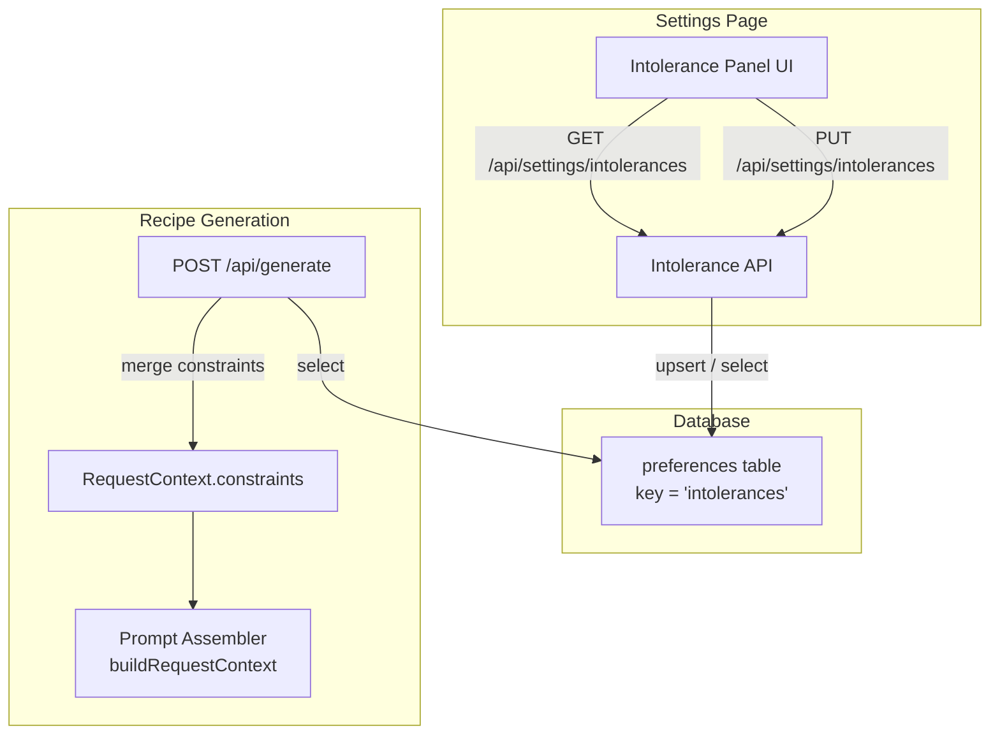

# Design Document: Intolerance Settings

## Overview

This feature adds a food intolerance management panel to the existing MISE settings page. Users select intolerances from a categorized, predefined list; selections are persisted to the `preferences` table via a new API endpoint; and saved intolerances are automatically injected as constraints into the recipe generation prompt pipeline.

The design leverages existing infrastructure: the `preferences` table (with RLS), the `RequestContext.constraints` array in the prompt assembler, and the settings page's client-side pattern of fetch + state + save.

## Architecture



The flow has two independent paths:

1. **Settings path**: UI ↔ Intolerance API ↔ `preferences` table. The user reads/writes their intolerance selections.
2. **Generation path**: Generate route reads the user's intolerances from `preferences`, merges them with any per-request constraints, and passes the combined list into the existing `RequestContext.constraints` pipeline.

No new tables or schema changes are required. The existing `preferences` table with `(user_id, key)` unique constraint and RLS policies covers all storage needs.

## Components and Interfaces

### 1. Intolerance Constants (`src/lib/intolerance-constants.ts`)

A shared module defining the canonical intolerance list, categories, and validation. Follows the same pattern as `complexity-modes.ts`.

```typescript
export interface IntoleranceItem {
  id: string;        // e.g. "gluten", "lactose"
  label: string;     // e.g. "Gluten", "Lactose"
  category: string;  // e.g. "Grains & Gluten"
}

export interface IntoleranceCategory {
  name: string;
  items: IntoleranceItem[];
}

export const INTOLERANCE_CATEGORIES: IntoleranceCategory[];
export const ALL_INTOLERANCE_IDS: Set<string>;
export function isValidIntoleranceId(id: string): boolean;
```

Categories:
- Dairy & Eggs: lactose, casein, eggs
- Grains & Gluten: gluten, wheat, corn
- Nuts & Seeds: tree-nuts, peanuts, sesame
- Seafood: shellfish, fish, mollusks
- Other Common Intolerances: soy, sulfites, nightshades, fodmaps, histamine, mustard, celery, lupin, alcohol, fructose

### 2. Intolerance API (`src/app/api/settings/intolerances/route.ts`)

Two handlers on a single route:

**GET** — Returns the user's saved intolerance IDs.
- Auth: requires authenticated session via `createClient()` + `getUser()`
- Reads from `preferences` where `key = 'intolerances'`
- Returns `{ intolerances: string[] }` (empty array if no record)

**PUT** — Saves the user's intolerance selections.
- Auth: same as GET
- Body: `{ intolerances: string[] }`
- Validates each ID against `ALL_INTOLERANCE_IDS`
- Upserts into `preferences` with `key = 'intolerances'`, `value = { items: [...] }`, `source = 'explicit'`, `confidence = 1.0`
- Returns `{ success: true }` or error

### 3. Intolerance Panel UI (within `src/app/(studio)/settings/page.tsx`)

A new card section added below the existing "Default Complexity Mode" card. Uses the same styling patterns (rounded-lg border, Tailwind classes).

- On mount: fetches `GET /api/settings/intolerances` to populate checkbox state
- Renders categorized checkboxes with category headings
- Save button triggers `PUT /api/settings/intolerances`
- Shows success/error feedback inline (same pattern as complexity mode save)
- Keyboard navigable with proper `<label>` wrapping and ARIA attributes

### 4. Generate Route Modification (`src/app/api/generate/route.ts`)

After authenticating the user and before building `RequestContext`:
- Fetch `preferences` row where `key = 'intolerances'`
- Map each intolerance ID to a constraint string: `"No {label}"`
- Merge with any `body.constraints` from the request, deduplicating
- Pass merged array as `ctx.constraints`

### 5. Constraint Formatting Helper (`src/lib/intolerance-constants.ts`)

```typescript
export function formatIntoleranceConstraints(ids: string[]): string[];
```

Maps intolerance IDs to human-readable constraint strings (e.g., `"gluten"` → `"No gluten"`). Used by the generate route.

## Data Models

### Preferences Table Record

Uses the existing `preferences` table — no migration needed.

| Column     | Value                                          |
|------------|------------------------------------------------|
| user_id    | UUID (from auth)                               |
| key        | `"intolerances"`                               |
| value      | `{ "items": ["gluten", "lactose", ...] }`      |
| confidence | `1.0`                                          |
| source     | `"explicit"`                                   |

The `unique(user_id, key)` constraint ensures one intolerances record per user. The upsert operation (`ON CONFLICT (user_id, key) DO UPDATE`) handles both create and update.

### API Request/Response Shapes

**GET /api/settings/intolerances**
```typescript
// Response 200
{ intolerances: string[] }  // e.g. ["gluten", "lactose"]
```

**PUT /api/settings/intolerances**
```typescript
// Request body
{ intolerances: string[] }  // e.g. ["gluten", "lactose"]

// Response 200
{ success: true }

// Response 400 (invalid IDs)
{ error: string, invalidIds: string[] }

// Response 401
{ error: "Sign in required." }
```


## Correctness Properties

*A property is a characteristic or behavior that should hold true across all valid executions of a system — essentially, a formal statement about what the system should do. Properties serve as the bridge between human-readable specifications and machine-verifiable correctness guarantees.*

### Property 1: Intolerance save/load round-trip with upsert idempotence

*For any* valid subset of intolerance IDs and any number of sequential save operations, loading the user's intolerances should return exactly the set from the most recent save, and only one `"intolerances"` record should exist for that user.

**Validates: Requirements 2.1, 3.1, 5.2**

### Property 2: Validation accepts only canonical intolerance IDs

*For any* array of strings, the validation function should accept all strings that exist in `ALL_INTOLERANCE_IDS` and reject all strings that do not, returning the exact partition of valid and invalid IDs.

**Validates: Requirements 2.4**

### Property 3: Intolerance constraint formatting

*For any* valid intolerance ID, `formatIntoleranceConstraints` should produce a string of the form `"No {label}"` where `{label}` matches the label defined in `INTOLERANCE_CATEGORIES` for that ID.

**Validates: Requirements 4.2**

### Property 4: Constraint merge produces unique union

*For any* two arrays of constraint strings (user-saved intolerance constraints and per-request constraints), the merged result should contain every unique string from both arrays, have no duplicates, and have a length equal to the number of distinct strings across both inputs.

**Validates: Requirements 4.5**

## Error Handling

| Scenario | Handling |
|---|---|
| Unauthenticated request to Intolerance API | Return 401 `{ error: "Sign in required." }` |
| PUT with invalid intolerance IDs | Return 400 `{ error: "Invalid intolerance IDs", invalidIds: [...] }`. Do not persist partial data. |
| PUT with empty array | Valid operation — clears all intolerances. Upsert with `{ items: [] }`. |
| PUT with non-array body or missing field | Return 400 `{ error: "Bad request." }` |
| Database error on save | Return 500 `{ error: "Failed to save intolerances." }`. UI retains unsaved selections. |
| Database error on load (settings page) | UI shows panel with all items unselected, displays subtle error note. Non-blocking. |
| Database error on load (generate route) | Non-fatal — proceed with generation without intolerance constraints. Log warning. |
| Intolerance ID in DB no longer in canonical list | Silently filter out stale IDs on load. Return only currently valid IDs. |

## Testing Strategy

### Unit Tests (Vitest)

- **Intolerance constants**: Verify `ALL_INTOLERANCE_IDS` matches flattened categories, `isValidIntoleranceId` accepts/rejects correctly, no duplicate IDs across categories.
- **Constraint formatting**: `formatIntoleranceConstraints` returns correct strings for known IDs, returns empty array for empty input.
- **Constraint merging**: Merge function handles empty arrays, overlapping items, and disjoint sets.
- **API validation**: Invalid IDs rejected, empty array accepted, non-array body rejected.
- **Auth guard**: Unauthenticated requests return 401.

### Property-Based Tests (Vitest + fast-check)

Each property test runs a minimum of 100 iterations using `fast-check`.

- **Property 1** — Round-trip: Generate random subsets of `ALL_INTOLERANCE_IDS`, simulate save then load through the persistence logic, verify equality. Tag: `Feature: intolerance-settings, Property 1: save/load round-trip with upsert idempotence`
- **Property 2** — Validation: Generate arrays mixing valid IDs and arbitrary strings, verify partition. Tag: `Feature: intolerance-settings, Property 2: validation accepts only canonical intolerance IDs`
- **Property 3** — Formatting: Generate random subsets of valid IDs, verify each formatted string matches `"No {label}"`. Tag: `Feature: intolerance-settings, Property 3: intolerance constraint formatting`
- **Property 4** — Merge: Generate pairs of string arrays, verify unique union invariant. Tag: `Feature: intolerance-settings, Property 4: constraint merge produces unique union`

### Integration Tests

- Settings page renders intolerance panel with all categories and items.
- Save flow: select intolerances → save → reload page → verify pre-selected.
- Generate route: saved intolerances appear in prompt constraints.
- RLS: user A cannot read user B's intolerance preferences (covered by existing RLS policies).
