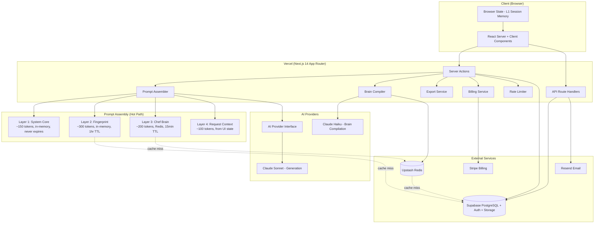
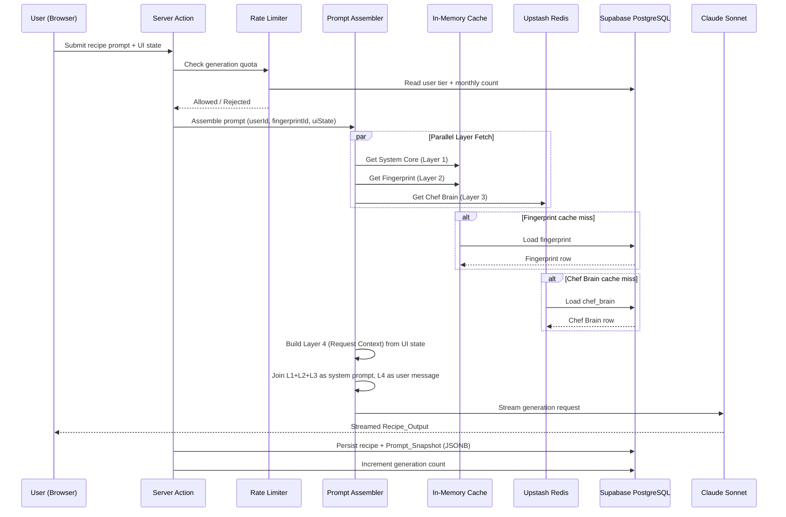
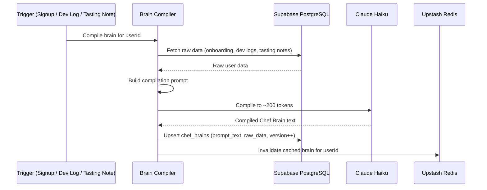

# Design Document: MISE — Culinary Development Engine

## Overview

MISE is a Next.js 14 (App Router) web application deployed on Vercel that generates structured, restaurant-quality recipes through a 4-layer prompt architecture. The system uses Claude Sonnet (via Anthropic API, behind an abstraction layer) for recipe generation and Claude Haiku for Chef Brain compilation. All data persists in Supabase PostgreSQL, with a two-tier caching strategy: in-memory for static/semi-static prompt layers and Redis (Upstash) for per-user compiled data.

The core differentiator is output quality — the 4-layer prompt architecture (System Core + Chef Fingerprint + User Chef Brain + Request Context) encodes deep cooking knowledge that produces genuinely better recipes than a general-purpose AI. Chef Fingerprints are the product's IP: distilled decision trees (~300 tokens each) extracted offline from deep biographical research, not raw biographies. Chef Brain is the personalization layer: a compiled ~200-token prompt fragment that learns from a user's development logs and tasting notes over time.

### Key Design Decisions

- **4-Layer Prompt Architecture**: Every generation assembles System Core (~150 tokens) + Fingerprint (~300 tokens) + Chef Brain (~200 tokens) + Request Context (~100 tokens). Layers 1–3 form the system prompt; Layer 4 is the user message. Total ~850 tokens input, ~1200 tokens output ≈ $0.021/generation on Sonnet.
- **Prompt Assembler as the hot path**: Fetches all 4 layers in parallel (memory, memory cache, Redis, UI state). No Postgres on the hot path.
- **Brain Compiler uses Haiku (25x cheaper)**: Compiles raw user data into ~200-token Chef Brain fragments. Runs infrequently (signup, after dev log entries). Cost: ~$0.0001 per compilation.
- **Fingerprints are operator-edited only**: Users select fingerprints but never edit them. Biographical depth is for offline training, not runtime injection.
- **Prompt Snapshot for reproducibility**: Every recipe stores a JSONB snapshot of all 4 layers used, their versions, and token counts.
- **Supabase as sole persistence layer**: PostgreSQL for all relational data, Supabase Auth for authentication, Supabase Storage for file assets.
- **AI Model Abstraction Layer**: All AI interactions go through an `AIProvider` interface. Claude is the initial implementation, but the provider pattern allows swapping without changing calling code. Provider selection: `ai_provider_config` table (runtime override) → `AI_PROVIDER` env var (default).
- **Component-Based Recipe Model**: A recipe is NOT a flat list of ingredients and steps. It's a set of Components (the braise, the sauce, the garnish) that each have their own ingredients, steps, and doneness cues. This mirrors how professional kitchens actually think about dishes.
- **Structured JSON + Zod Validation**: The AI outputs valid JSON matching a Zod schema. Validated on the way out. If validation fails, automatic retry with correction prompt. Markdown is never stored — it's rendered on demand from structured JSON.
- **Seven Display Modes from One Data Source**: All display modes (Brief, Full Recipe, Cook, Flavour Map, Shopping List, Timeline, Riff) are pure render functions over the same stored Recipe JSON. No additional API calls for switching views.
- **The Dial (Version-Generating Evolution Tool)**: The Dial is not a taste profile switcher — it's a recipe evolution tool. Each push (More Acid, Smokier, More Umami, etc.) generates a full new recipe version via an API call, with the previous version preserved. The Dial history becomes a record of how the recipe developed. Users can compare versions side by side, cook both, and dial again from any version. This is distinct from stored `TasteProfile` adjustments — those are instant previews; the Dial creates permanent versioned branches.
- **"The Thinking" Field**: Every recipe includes a `thinking` field — the chef's reasoning behind the dish architecture, the logic of the flavour decisions, and what culinary pattern this recipe teaches. Generated alongside the recipe, stored as structured text. This is what separates MISE from a recipe generator.
- **Recipe Forking (V3)**: When another user saves and cooks a shared recipe, their version forks from the original. Forks are linked to the parent version. The original author can see forks and dial from them. The data model accommodates this from V1 (via `recipe_forks` table) even though the UI ships in V3.
- **"The One Thing Worth Getting"**: The shopping list renderer generates a single sentence identifying the ingredient where quality makes the biggest difference to the final dish, derived from the recipe's flavour architecture. Not a list — one sentence, always useful.
- **Building Blocks Library + Generation-Time Lookup**: Sub-recipes are first-class objects. During generation, MISE checks the user's library for existing sub-recipe versions (e.g., their tahini, their preserved lemon method) and uses those instead of generating generic ones. The recipe notes which library items were used.
- **Multi-Dish Timeline**: `renderTimeline` supports both single-recipe and multi-dish meal planning. The multi-dish view takes an array of recipes with a shared serve time and interleaves all components into a single kitchen schedule with free-time windows identified.
- **Sub-Recipes as First-Class Objects**: Every sauce, pickle, spice blend is a standalone recipe in the library. Parent recipes reference them by ID. Users can pull them out and reuse them.
- **Three Complexity Modes**: Foundation (learning), Kitchen (default, professional), Riff (architecture only). Remembered per user, overridable per recipe.
- **Canadian English throughout**: All user-facing strings use Canadian spelling (flavour, colour, favourite, etc.).
- **V1 ships with 6 external services**: Supabase, Vercel, Stripe, Anthropic API, Upstash, Resend.

## Architecture



### Generation Request Flow



### Brain Compilation Flow



## Components and Interfaces

### Prompt Assembler

The central module that fetches all 4 prompt layers in parallel, assembles them, and streams the generation response. This is the hot path — it must never hit Postgres directly (only memory and Redis caches).

```typescript
// Layer definitions
interface PromptLayer {
  text: string;
  version: number;
  tokenCount: number;
}

interface AssembledPrompt {
  systemPrompt: string;       // Layers 1+2+3 joined
  userMessage: string;         // Layer 4
  layers: {
    systemCore: PromptLayer;
    fingerprint: PromptLayer;
    chefBrain: PromptLayer;
    requestContext: PromptLayer;
  };
}

interface PromptSnapshot {
  systemCore: PromptLayer;
  fingerprint: PromptLayer & { fingerprintId: string; fingerprintName: string };
  chefBrain: PromptLayer & { userId: string };
  requestContext: PromptLayer;
  totalInputTokens: number;
  totalOutputTokens: number;
  estimatedCost: number;
  assembledAt: string;  // ISO timestamp
}

// Prompt Assembler module
async function assemblePrompt(
  userId: string,
  fingerprintId: string,
  requestContext: RequestContext
): Promise<AssembledPrompt>

async function generateRecipe(
  userId: string,
  fingerprintId: string,
  requestContext: RequestContext,
  complexityMode: ComplexityMode
): Promise<ReadableStream<Recipe>>

function buildPromptSnapshot(
  assembled: AssembledPrompt,
  outputTokens: number
): PromptSnapshot
```

### Fingerprint Cache

In-memory cache for fingerprint prompt texts with 1-hour TTL. Invalidated on database update.

```typescript
interface CachedFingerprint {
  id: string;
  name: string;
  promptText: string;
  version: number;
  cachedAt: number;  // Date.now()
}

// In-memory cache with 1hr TTL
function getFingerprint(id: string): Promise<CachedFingerprint>
function invalidateFingerprint(id: string): void
function preloadFingerprints(): Promise<void>  // Called at startup
```

### Brain Compiler

Compiles raw user data into a ~200-token Chef Brain prompt fragment using Claude Haiku.

```typescript
interface BrainCompilationInput {
  userId: string;
  onboardingAnswers: Record<string, string>;
  devLogs: Array<{ text: string; createdAt: string }>;
  tastingNotes: Array<{ taste: string; texture: string; aroma: string; comments: string }>;
  preferences: Array<{ key: string; value: string; confidence: number }>;
}

interface CompiledBrain {
  userId: string;
  promptText: string;    // ~200 tokens
  version: number;
  compiledAt: string;
}

async function compileBrain(input: BrainCompilationInput): Promise<CompiledBrain>
async function getCachedBrain(userId: string): Promise<CompiledBrain | null>  // Redis first, then DB
async function invalidateBrainCache(userId: string): Promise<void>
```

### AI Provider Interface (Model Abstraction Layer)

All AI interactions go through the `AIProvider` interface. The active provider is resolved by checking `ai_provider_config` for `is_active = true`, falling back to the `AI_PROVIDER` env var.

```typescript
interface AIProviderError {
  code: 'rate_limit' | 'auth_failed' | 'timeout' | 'invalid_response' | 'unknown';
  message: string;
  retryable: boolean;
  retryAfterMs?: number;
}

interface AIProviderInfo {
  name: string;
  displayName: string;
  supportedModels: string[];
  requiresApiKey: boolean;
}

interface AIProvider {
  readonly info: AIProviderInfo;

  generateRecipe(systemPrompt: string, userMessage: string): Promise<ReadableStream<string>>;
  compileBrain(compilationPrompt: string): Promise<string>;
  suggestPairings(ingredient: string, systemPrompt: string): Promise<PairingSuggestion[]>;
  suggestSubstitutions(
    ingredient: Ingredient,
    recipeContext: string,
    systemPrompt: string
  ): Promise<Substitution[]>;
}

// Factory — resolves active provider
async function createAIProvider(): Promise<AIProvider>

// Provider registry
const providerRegistry: Record<string, (apiKey: string, modelId?: string) => AIProvider> = {
  claude: (apiKey, modelId) => new ClaudeProvider(apiKey, modelId),
};
```

### Recipe Data Model (Component-Based)

A recipe is a set of Components — not a flat list of ingredients and steps. Each component (the braise, the tahini sauce, the garnish) has its own ingredients, steps, and doneness cues. This mirrors how professional kitchens think about dishes.

```typescript
interface Recipe {
  // identity
  id: string;
  title: string;
  fingerprint: string;
  version: number;

  // intent
  intent: {
    occasion: string;       // weeknight, dinner party, meal prep
    mood: string;           // comfort, impressive, experimental
    season: string[];
    time: number;           // total minutes
    effort: 'low' | 'medium' | 'high' | 'project';
  };

  // flavour architecture
  flavour: {
    profile: string[];      // ['bright', 'umami', 'herbaceous']
    dominant: string;       // 'acid-led', 'fat-led', 'spice-led'
    acid: AcidNote[];
    fat: FatNote[];
    heat: HeatNote;
    sweet: SweetNote;
    texture: TextureContrast[];
    balance: string;        // chef's note on the flavour architecture
  };

  // components (NOT flat ingredients)
  components: Component[];

  // timeline
  timeline: TimelineStage[];

  // variations
  variations: {
    dietary: Variation[];
    pantry: Variation[];
    scale: ScaleNote;
    profiles: TasteProfile[];  // spicier, more acid, more umami
  };

  // related
  related: {
    sub_recipes: string[];    // IDs of standalone sub-recipe objects
    pairs_with: string[];     // what to serve alongside
    next_level: string;       // what to try after mastering this
  };

  // the thinking — chef's reasoning behind the dish
  thinking: {
    approach: string;         // how the chef approached this dish
    architecture: string;     // the logic behind the flavour decisions
    pattern: string;          // what culinary pattern this recipe teaches
  };

  // metadata
  promptSnapshot: PromptSnapshot;
  complexityMode: ComplexityMode;
  cooked: boolean;
  devNotes: string | null;
  tags: string[];
  isPublic: boolean;
  createdAt: string;
  updatedAt: string;
}

interface Component {
  name: string;               // "the braise", "the tahini sauce"
  role: string;               // "base", "sauce", "texture", "garnish", "acid element"
  can_prep_ahead: boolean;
  prep_ahead_notes: string;
  ingredients: Ingredient[];
  steps: Step[];
  doneness_cues: string[];    // what it should look, smell, feel like when done
}

interface Ingredient {
  name: string;
  amount: number;
  unit: string;
  substitutions: {
    common: Substitution[];
    dietary: Substitution[];
    pantry: Substitution[];
    flavour_shift: Substitution[];
  };
  sourcing: string;           // "use good quality, it matters here"
  prep: string;               // "room temperature", "finely sliced"
  function: string;           // "acid structure", "fat", "texture"
  essential: boolean;         // false = nice to have
}

interface Substitution {
  name: string;
  amount: number;
  unit: string;
  notes: string;
}

interface Step {
  stepNumber: number;
  instruction: string;
  timing: string | null;
  techniqueReason: string | null;
  seasoningNote: string | null;
}

interface TasteProfile {
  name: string;               // "Current", "More Acid", "More Heat", "More Umami", "Smokier", "Lighter"
  adjustments: Array<{
    componentName: string;
    ingredientChanges: Array<{ name: string; amount: number; unit: string; action: 'add' | 'replace' | 'remove' }>;
    techniqueChanges: string[];
  }>;
}

type ComplexityMode = 'foundation' | 'kitchen' | 'riff';

// Flavour architecture types
interface AcidNote { source: string; role: string; }
interface FatNote { source: string; role: string; }
interface HeatNote { level: string; source: string; }
interface SweetNote { level: string; source: string; }
interface TextureContrast { element: string; contrast: string; }
interface Variation { name: string; changes: string; }
interface ScaleNote { min: number; max: number; notes: string; }
interface TimelineStage { name: string; duration: number; parallel: boolean; description: string; }
```

### Zod Schema Validation (Structured Generation)

The AI outputs valid JSON matching a Zod schema. Validated on the way out. If validation fails, automatic retry with correction prompt (up to 2 retries).

```typescript
import { z } from 'zod';

const RecipeSchema: z.ZodType<Recipe> = z.object({ /* mirrors Recipe interface */ });

async function generateStructuredRecipe(params: {
  prompt: string;
  fingerprint: string;
  chefBrain: string;
  outputSchema: z.ZodType<Recipe>;
  complexityMode: ComplexityMode;
}): Promise<Recipe>

function validateRecipe(data: unknown): { valid: boolean; errors: string[] }
```

### Display Renderers (Seven Modes)

All modes render from the same stored Recipe JSON. Pure functions — no API calls. No markdown is stored; it's generated on demand.

```typescript
// 1. The Brief — one screen, no explanation, for experienced cooks
function renderBrief(recipe: Recipe): string

// 2. The Full Recipe — traditional format, the default document view
function renderFullRecipe(recipe: Recipe): string

// 3. The Cook — active cooking interface, one stage at a time, doneness cues
function renderCookMode(recipe: Recipe, currentStage: number): string

// 4. The Flavour Map — no amounts, no method, just the architecture
function renderFlavourMap(recipe: Recipe): string

// 5. The Shopping List — organized by store section, personalized with pantry, includes "the one thing worth getting"
function renderShoppingList(recipe: Recipe, userPantry: string[]): ShoppingListView

interface ShoppingListView {
  sections: Array<{ section: string; items: Array<{ name: string; amount: number; unit: string; checkStock: boolean }> }>;
  alreadyHave: string[];                // from user's pantry constants
  theOneThingWorthGetting: string;      // single sentence: the ingredient where quality matters most
}

// 6. The Timeline — horizontal bars working backward from serve time (single or multi-dish)
function renderTimeline(recipe: Recipe, serveTime: Date): string
function renderMultiDishTimeline(recipes: Recipe[], serveTime: Date): MultiDishTimeline

interface MultiDishTimeline {
  startTime: Date;
  serveTime: Date;
  schedule: Array<{ time: Date; recipeName: string; componentName: string; duration: number }>;
  freeWindows: Array<{ start: Date; end: Date; duration: number }>;
  prepAhead: Array<{ recipeName: string; componentName: string; notes: string }>;
}

// 7. The Riff — intention and architecture only, no amounts
function renderRiff(recipe: Recipe): string
```

### Batch Scaler

Recalculates ingredient quantities across all components for different serving sizes. Pure function, no side effects.

```typescript
interface ScaledRecipe {
  original: Recipe;
  scaled: Recipe;
  multiplier: number;
}

// Pure functions — scales every component's ingredients
function scaleRecipe(recipe: Recipe, targetServings: number): ScaledRecipe
function scaleComponent(component: Component, multiplier: number): Component
function roundToKitchenPrecision(quantity: number): number
// > 10g: nearest whole gram
// ≤ 10g: nearest 0.5g
```

### Rate Limiter

Enforces generation limits per plan tier and maximum token caps per request.

```typescript
type PlanTier = 'free' | 'home_cook' | 'creator' | 'brigade';

interface RateLimitResult {
  allowed: boolean;
  remaining: number;
  resetDate: string;       // ISO date of next month reset
  reason?: string;
}

interface GenerationCostRecord {
  userId: string;
  recipeId: string;
  inputTokens: number;
  outputTokens: number;
  estimatedCost: number;   // USD
  createdAt: string;
}

const GENERATION_LIMITS: Record<PlanTier, number | null> = {
  free: 10,
  home_cook: null,  // unlimited
  creator: null,
  brigade: null,
};

const MAX_INPUT_TOKENS = 1200;   // ~850 budget + safety margin
const MAX_OUTPUT_TOKENS = 2000;  // ~1200 budget + safety margin

async function checkRateLimit(userId: string): Promise<RateLimitResult>
async function recordGenerationCost(record: GenerationCostRecord): Promise<void>
```

### Billing Service

Stripe integration for subscriptions and one-time Kitchen Drop purchases.

```typescript
interface SubscriptionPlan {
  tier: PlanTier;
  stripePriceId: string;
  price: number;           // monthly USD
  features: string[];
}

const PLANS: SubscriptionPlan[] = [
  { tier: 'free', stripePriceId: '', price: 0, features: ['10 gen/month', '1 fingerprint'] },
  { tier: 'home_cook', stripePriceId: 'price_xxx', price: 9, features: ['Unlimited gen', 'All fingerprints', 'Library', 'Export'] },
  { tier: 'creator', stripePriceId: 'price_xxx', price: 19, features: ['...plus branding', 'Custom fingerprints', 'Collections'] },
  { tier: 'brigade', stripePriceId: 'price_xxx', price: 49, features: ['...plus team', 'API access'] },
];

// Stripe checkout
async function createCheckoutSession(userId: string, tier: PlanTier): Promise<{ url: string }>
async function createKitchenDropCheckout(userId: string, kitchenId: string): Promise<{ url: string }>

// Webhook handlers
async function handleSubscriptionCreated(event: Stripe.Event): Promise<void>
async function handleSubscriptionUpdated(event: Stripe.Event): Promise<void>
async function handleSubscriptionDeleted(event: Stripe.Event): Promise<void>
async function handlePaymentFailed(event: Stripe.Event): Promise<void>
async function handleKitchenDropPurchase(event: Stripe.Event): Promise<void>

// Account management
async function getUserBillingInfo(userId: string): Promise<{
  tier: PlanTier;
  nextBillingDate: string | null;
  portalUrl: string;
}>
```

### Export Service

Renders recipes as PDF cards and Markdown files from structured Recipe JSON. V1: basic formatting. V2: styled HTML via Puppeteer/Browserless.

```typescript
interface ExportOptions {
  format: 'pdf' | 'markdown';
  displayMode: 'full' | 'brief' | 'shopping_list';
  includeScaling: boolean;
  branding?: { name: string; businessName?: string };  // Creator/Brigade only
}

async function exportRecipe(recipe: Recipe, options: ExportOptions): Promise<Buffer | string>
async function exportRecipeAsPdf(recipe: Recipe, options: ExportOptions): Promise<Buffer>
async function exportRecipeAsMarkdown(recipe: Recipe): Promise<string>
```

### Auth Service

Supabase Auth wrapper for user registration, login, and session management.

```typescript
interface UserRecord {
  id: string;
  email: string;
  tier: PlanTier;
  stripeCustomerId: string | null;
  createdAt: string;
}

async function register(email: string, password: string): Promise<UserRecord>
async function login(email: string, password: string): Promise<UserRecord>
async function logout(): Promise<void>
async function getCurrentUser(): Promise<UserRecord | null>
// V2: Social login
async function loginWithGoogle(): Promise<UserRecord>
async function loginWithGithub(): Promise<UserRecord>
```

### Version Store

Tracks recipe versions, diffs, and version history. Recipes accumulate data over time — versions, session data, ratings, notes. Version control for cooking.

```typescript
interface RecipeVersion {
  id: string;
  recipeId: string;
  versionNumber: number;
  recipe: Recipe;
  promptSnapshot: PromptSnapshot;
  createdAt: string;
}

async function createVersion(recipeId: string, recipe: Recipe, snapshot: PromptSnapshot): Promise<RecipeVersion>
async function getVersionHistory(recipeId: string): Promise<RecipeVersion[]>
async function diffVersions(versionA: string, versionB: string): Promise<RecipeDiff>
async function revertToVersion(recipeId: string, versionId: string): Promise<RecipeVersion>
```

### The Dial (Recipe Evolution Tool)

The Dial is distinct from stored taste profiles. Taste profiles are instant previews of adjustments stored at creation time. The Dial generates a full new recipe version via an API call — a permanent versioned branch. Each push preserves the previous version. The Dial history becomes a record of how the recipe developed over time.

```typescript
type DialDirection =
  | 'more_acid' | 'more_heat' | 'more_umami' | 'smokier'
  | 'lighter' | 'funkier' | 'different_region' | 'riff_mode';

interface DialResult {
  newVersion: RecipeVersion;
  changes: string;            // human-readable summary of what changed
  previousVersionId: string;
}

// Generates a full new recipe version via API call
// The prompt includes the current recipe JSON + the dial direction
// The AI produces a new Recipe with adjustments, preserving the original
async function dialRecipe(
  recipeId: string,
  direction: DialDirection,
  userId: string
): Promise<DialResult>

// Returns the full dial history for a recipe (all versions with their dial directions)
async function getDialHistory(recipeId: string): Promise<Array<{
  version: RecipeVersion;
  dialDirection: DialDirection | null;  // null for the original generation
}>>
```

### V2 Component Interfaces

These components are defined at interface level for V2 planning. Detailed implementation design will be done in Phase 2.

#### Memory System

```typescript
// L1: Session Memory (ephemeral, browser state + lightweight DB record)
interface SessionMemory {
  sessionId: string;
  userId: string;
  recipeId: string;
  startedAt: string;
  currentStage: CookingStage;
  stagesCompleted: CookingStage[];
  questionsAsked: Array<{ question: string; answer: string; stage: CookingStage; askedAt: string }>;
  substitutions: Array<{ original: string; replacement: string; stage: CookingStage }>;
  timerStates: Array<{ label: string; remaining: number; active: boolean }>;
}

// L2: Preference Memory (structured, queryable, visible to user)
interface PreferenceEntry {
  userId: string;
  key: string;              // e.g., "doubles_preserved_lemon", "prefers_cast_iron"
  value: Record<string, unknown>;
  confidence: number;       // 0.0–1.0
  source: 'rating' | 'dev_note' | 'chat' | 'tasting_note';
  updatedAt: string;
}

// L3: Identity Memory = Chef Brain (already defined above)

// L4: Pattern Memory (inferred, invisible to user)
interface PatternMemory {
  userId: string;
  cookingFrequency: Record<string, number>;       // fingerprint_id → count
  techniqueProgression: string[];                   // ordered by first use
  flavourExplorationPatterns: Record<string, number>; // flavour_profile → count
  lastUpdated: string;
}
```

#### Stage Tracker

```typescript
type CookingStage = 'PREP' | 'ACTIVE' | 'WAITING' | 'FINISH' | 'PLATE';

interface StageDefinition {
  stage: CookingStage;
  title: string;
  steps: MethodStep[];
  sensoryCue: string;       // "When the onions are translucent and fragrant..."
  estimatedMinutes: number;
}

interface StageTrackerState {
  recipeId: string;
  stages: StageDefinition[];
  currentStage: CookingStage;
  stageStartedAt: string;
  timers: Array<{ id: string; label: string; durationSeconds: number; remainingSeconds: number; active: boolean }>;
}

function breakRecipeIntoStages(recipe: Recipe): StageDefinition[]
function getNextStage(current: CookingStage): CookingStage | null
```

#### Chat Layer

```typescript
type ChatMode = 'discovery' | 'active_cooking' | 'development';

interface ChatMessage {
  id: string;
  role: 'user' | 'assistant';
  content: string;
  mode: ChatMode;
  stage?: CookingStage;     // Only in active_cooking mode
  createdAt: string;
}

interface ChatContext {
  mode: ChatMode;
  chefBrain: string;
  currentRecipe: Recipe | null;
  currentStage: CookingStage | null;
  cookingHistory: Array<{ recipeId: string; rating: Rating | null }>;
}

function determineChatMode(sessionActive: boolean, sessionEnded: boolean): ChatMode
async function sendChatMessage(message: string, context: ChatContext): Promise<ReadableStream<string>>
```

#### Rating System

```typescript
type CookAgain = 'absolutely' | 'maybe_tweaked' | 'probably_not';
type Highlight = 'flavour' | 'technique' | 'the_occasion' | 'surprised_me';
type ChangeOption = 'nothing' | 'more_acid' | 'different_texture' | 'different_technique' | 'something_else';

interface Rating {
  recipeId: string;
  userId: string;
  cookAgain: CookAgain;
  highlight: Highlight;
  changeNote: ChangeOption;
  changeText?: string;       // Only when changeNote === 'something_else'
  cookedAt: string;
}

async function submitRating(rating: Rating): Promise<void>
// Side effects: persists to ratings table, writes to preferences if "something_else", triggers brain recompilation
```

#### Timeline

```typescript
type TimelineEntryType = 'generation' | 'question' | 'session' | 'rating' | 'dev_note' | 'idea';

interface TimelineEntry {
  id: string;
  userId: string;
  type: TimelineEntryType;
  content: Record<string, unknown>;
  createdAt: string;
}

async function getTimeline(
  userId: string,
  filters?: { types?: TimelineEntryType[]; search?: string }
): Promise<TimelineEntry[]>
```

#### Recipe Canvas

```typescript
type SidebarMode = 'before_cooking' | 'during_cooking' | 'after_cooking';

interface CanvasState {
  recipe: Recipe;
  sidebarMode: SidebarMode;
  sessionMemory: SessionMemory | null;
  activeTasteProfile: string;          // name of active TasteProfile
  activeComplexityMode: ComplexityMode;
  activeDisplayMode: 'brief' | 'full' | 'cook' | 'flavour_map' | 'shopping_list' | 'timeline' | 'riff';
  annotations: Array<{ componentName: string; sectionType: 'ingredient' | 'step'; sectionIndex: number; note: string }>;
}
```

## Data Models

### Supabase PostgreSQL Schema

```mermaid
erDiagram
    users {
        uuid id PK
        text email
        text tier "free | home_cook | creator | brigade"
        text stripe_customer_id
        text default_complexity_mode "foundation | kitchen | riff"
        integer generation_count_this_month
        date generation_count_reset_date
        jsonb pantry_constants "Chef Brain pantry items"
        timestamptz created_at
        timestamptz updated_at
    }

    fingerprints {
        uuid id PK
        text name
        text prompt_text "~300 tokens"
        jsonb full_profile "source biographical research"
        integer version
        boolean is_default
        timestamptz created_at
        timestamptz updated_at
    }

    chef_brains {
        uuid id PK
        uuid user_id FK
        text prompt_text "~200 tokens"
        jsonb raw_data "source inputs"
        integer version
        timestamptz compiled_at
    }

    recipes {
        uuid id PK
        uuid user_id FK
        uuid fingerprint_id FK
        text title
        integer version
        text fingerprint_hash
        jsonb intent "occasion mood season time effort"
        jsonb flavour "profile dominant acid fat heat sweet texture balance"
        jsonb components "Component[] with ingredients steps doneness_cues"
        jsonb timeline "TimelineStage[]"
        jsonb variations "dietary pantry scale profiles(TasteProfile[])"
        jsonb related "sub_recipes pairs_with next_level"
        jsonb thinking "approach architecture pattern"
        jsonb prompt_used "Prompt_Snapshot JSONB"
        text complexity_mode "foundation | kitchen | riff"
        boolean cooked "default false"
        text dev_notes
        jsonb tags
        boolean is_public "default false"
        timestamptz created_at
        timestamptz updated_at
    }

    recipe_forks {
        uuid id PK
        uuid source_recipe_id FK "original recipe"
        integer source_version "version forked from"
        uuid forked_recipe_id FK "the fork"
        uuid forked_by_user_id FK
        timestamptz forked_at
    }

    sub_recipe_refs {
        uuid id PK
        uuid parent_recipe_id FK
        uuid child_recipe_id FK
        text role "sauce pickle spice_blend condiment"
        timestamptz created_at
    }

    recipe_versions {
        uuid id PK
        uuid recipe_id FK
        integer version_number
        jsonb recipe_data "full Recipe JSON"
        jsonb prompt_snapshot
        text dial_direction "null for original, else the Dial direction used"
        timestamptz created_at
    }

    fermentation_logs {
        uuid id PK
        uuid recipe_id FK
        uuid user_id FK
        date start_date
        integer target_duration_days
        numeric temperature
        text method_description
        text status "active | completed | failed"
        timestamptz created_at
        timestamptz updated_at
    }

    tasting_notes {
        uuid id PK
        uuid recipe_id FK
        uuid user_id FK
        text taste
        text texture
        text appearance
        text aroma
        text overall
        text comments
        timestamptz created_at
    }

    sessions {
        uuid id PK
        uuid user_id FK
        uuid recipe_id FK
        timestamptz started_at
        timestamptz ended_at
        jsonb stages_completed
        jsonb questions_asked
        jsonb substitutions
        text summary
    }

    preferences {
        uuid id PK
        uuid user_id FK
        text key
        jsonb value
        float confidence
        text source "rating | dev_note | chat | tasting_note"
        timestamptz updated_at
    }

    ideas {
        uuid id PK
        uuid user_id FK
        uuid recipe_id FK
        text note
        text status "uncooked | annotated | generated"
        timestamptz created_at
    }

    ratings {
        uuid id PK
        uuid recipe_id FK
        uuid user_id FK
        text cook_again "absolutely | maybe_tweaked | probably_not"
        text highlight "flavour | technique | the_occasion | surprised_me"
        text change_note "nothing | more_acid | different_texture | different_technique | something_else"
        text change_text
        timestamptz cooked_at
    }

    kitchens {
        uuid id PK
        text name
        uuid fingerprint_id FK
        text zine_url
        timestamptz available_from
        timestamptz available_to
        integer units_total
        integer units_sold
        text stripe_price_id
    }

    kitchen_access {
        uuid id PK
        uuid user_id FK
        uuid kitchen_id FK
        timestamptz granted_at
    }

    ai_provider_config {
        uuid id PK
        text provider_name
        text api_key_encrypted
        text model_id
        boolean is_active
        timestamptz created_at
        timestamptz updated_at
    }

    generation_costs {
        uuid id PK
        uuid user_id FK
        uuid recipe_id FK
        integer input_tokens
        integer output_tokens
        numeric estimated_cost
        timestamptz created_at
    }

    users ||--o{ recipes : generates
    users ||--o{ chef_brains : has
    users ||--o{ sessions : cooks
    users ||--o{ preferences : accumulates
    users ||--o{ ideas : saves
    users ||--o{ ratings : submits
    users ||--o{ kitchen_access : purchases
    users ||--o{ generation_costs : incurs
    users ||--o{ fermentation_logs : tracks
    users ||--o{ tasting_notes : writes
    fingerprints ||--o{ recipes : styles
    fingerprints ||--o{ kitchens : themes
    recipes ||--o{ recipe_versions : versions
    recipes ||--o{ fermentation_logs : tracks
    recipes ||--o{ tasting_notes : receives
    recipes ||--o{ ratings : rated
    recipes ||--o{ ideas : filed_as
    recipes ||--o{ sessions : cooked_in
    recipes ||--o{ sub_recipe_refs : "parent of"
    recipes ||--o{ sub_recipe_refs : "child of"
    recipes ||--o{ recipe_forks : "source of"
    recipes ||--o{ recipe_forks : "forked as"
    kitchens ||--o{ kitchen_access : grants
```



### Key Schema Details

- **`recipes.components`**: JSONB array of `Component` objects. Each component has `name`, `role`, `can_prep_ahead`, `prep_ahead_notes`, `ingredients[]`, `steps[]`, and `doneness_cues[]`. This replaces the old flat `ingredients` and `method` columns.
- **`recipes.intent`**: JSONB containing `occasion`, `mood`, `season[]`, `time`, and `effort` level.
- **`recipes.flavour`**: JSONB containing the full flavour architecture — `profile[]`, `dominant`, `acid[]`, `fat[]`, `heat`, `sweet`, `texture[]`, and `balance` note.
- **`recipes.variations`**: JSONB containing `dietary[]`, `pantry[]`, `scale`, and `profiles[]` (TasteProfile objects for instant taste switching).
- **`recipes.related`**: JSONB containing `sub_recipes[]` (IDs), `pairs_with[]`, and `next_level`.
- **`recipes.complexity_mode`**: The complexity mode used for this recipe's generation. Overridable per recipe.
- **`recipes.prompt_used`**: JSONB containing the full `PromptSnapshot` — exact text of all 4 layers, versions, token counts, and estimated cost. Enables reproducibility.
- **`sub_recipe_refs`**: Join table for parent-child recipe relationships. Every sauce, pickle, spice blend is a standalone recipe. Parent recipes reference them here.
- **`users.default_complexity_mode`**: User's preferred complexity mode (foundation/kitchen/riff). Overridable per recipe.
- **`users.pantry_constants`**: JSONB array of ingredients the user always has on hand (from Chef Brain). Used by the Shopping List renderer to filter out "already have" items.
- **`recipe_versions.recipe_data`**: Full Recipe JSON snapshot (replaces old `recipe_output`).
- **`chef_brains.raw_data`**: JSONB containing the source inputs (onboarding answers, dev log excerpts, tasting note summaries) used for compilation.
- **`fingerprints.full_profile`**: JSONB reference of the source biographical research used to create the fingerprint offline. Not used at runtime.
- **`preferences.confidence`**: Float 0.0–1.0 indicating how confident the system is in this preference. Increases with repeated signals from multiple sources.
- **`generation_costs`**: Per-generation cost tracking for operational reporting. Links to user and recipe.
- **`recipes.thinking`**: JSONB containing `approach` (how the chef approached this dish), `architecture` (the logic behind the flavour decisions), and `pattern` (what culinary pattern this recipe teaches). Generated alongside the recipe by the AI.
- **`recipe_forks`**: Tracks when a user saves and cooks someone else's shared recipe. Links the forked recipe to the source recipe and version. The original author can see forks. V3 UI, but the table exists from V1 for data model readiness.
- **No `raw_display` column**: Display is always rendered from structured JSON via the 7 display mode functions. Markdown is never stored.

### Indexes

- `recipes(user_id, updated_at DESC)` — default library sort
- `recipes(user_id)` — GIN trigram index on `title` for text search
- `recipes(user_id, components)` — GIN index on JSONB for ingredient search within components
- `recipes(user_id, tags)` — GIN index for tag filtering
- `recipes(fingerprint_id)` — for filtering by fingerprint
- `recipes(user_id, intent)` — GIN index for filtering by occasion/mood/effort
- `sub_recipe_refs(parent_recipe_id)` — for finding a recipe's sub-recipes
- `sub_recipe_refs(child_recipe_id)` — for finding where a sub-recipe is used
- `chef_brains(user_id)` — unique, for fast brain lookup
- `fingerprints(is_default)` — for loading default fingerprints
- `fermentation_logs(user_id, status)` — for active fermentation queries
- `ratings(user_id, recipe_id)` — for rating lookups
- `preferences(user_id, key)` — unique, for preference lookups
- `generation_costs(user_id, created_at)` — for cost reporting
- `sessions(user_id, started_at DESC)` — for timeline queries
- `ideas(user_id, status)` — for idea filtering

## Correctness Properties

*A property is a characteristic or behavior that should hold true across all valid executions of a system — essentially, a formal statement about what the system should do. Properties serve as the bridge between human-readable specifications and machine-verifiable correctness guarantees.*

### Property 1: Recipe JSON/Zod schema validation round-trip

*For any* valid `Recipe` object, serializing to JSON via `JSON.stringify` then parsing back via `RecipeSchema.parse(JSON.parse(...))` should produce an object equivalent to the original — all fields (title, intent, flavour, components with their ingredients/steps/doneness_cues, timeline, variations including taste profiles, and related references) should be preserved.

**Validates: Requirements 5.6, 5.8**

### Property 2: Prompt assembly structure

*For any* valid generation request (userId, fingerprintId, requestContext), the assembled prompt's `systemPrompt` should contain the text of Layers 1, 2, and 3 (System Core, Fingerprint, Chef Brain) concatenated, and the `userMessage` should equal the Layer 4 (Request Context) text. All four layers should be non-empty.

**Validates: Requirements 5.1, 5.2**

### Property 3: Prompt layer content correctness

*For any* valid fingerprint and any user with a compiled Chef Brain, assembling a prompt should produce a system prompt that contains the fingerprint's `promptText` verbatim (Layer 2) and the user's Chef Brain `promptText` verbatim (Layer 3).

**Validates: Requirements 2.2, 4.5**

### Property 4: Prompt Snapshot completeness

*For any* generated recipe, the `prompt_used` JSONB field should contain a valid `PromptSnapshot` with: all 4 layer texts (non-empty), the fingerprint's id, name, and version matching the fingerprint used at generation time, the user's Chef Brain version, and token counts for each layer.

**Validates: Requirements 3.2, 5.5, 8.1**

### Property 5: System Core immutability

*For any* sequence of prompt assemblies, the System Core layer text and version should be identical across all of them — the System Core never changes at runtime.

**Validates: Requirements 1.4**

### Property 6: Fingerprint version increment on update

*For any* fingerprint, when the operator updates its `promptText`, the resulting version number should equal the previous version number plus one, and the updated record should be persisted with the new text.

**Validates: Requirements 3.1**

### Property 7: Cache invalidation on data update

*For any* fingerprint update, the in-memory fingerprint cache should return the updated version on the next read (not the stale version). *For any* Chef Brain recompilation, the Redis cache for that user should return the new compiled text on the next read.

**Validates: Requirements 3.3, 4.9, 6.3, 6.5**

### Property 8: Tier-based access control

*For any* user with a `free` tier: fingerprint selection should be restricted to one predefined fingerprint, recipe library save should be rejected with an upgrade message, and export should be rejected with an upgrade message. *For any* user with a paid tier (`home_cook`, `creator`, `brigade`): all five predefined fingerprints should be selectable, library and export should be allowed.

**Validates: Requirements 2.4, 2.5, 8.10, 10.5**

### Property 9: Component-based batch scaling correctness

*For any* valid `Recipe` with one or more components and any positive integer target serving size, `scaleRecipe(recipe, targetServings)` should produce a `ScaledRecipe` where: every ingredient in every component has its `unit` unchanged, its `amount` equals `roundToKitchenPrecision(original.amount * multiplier)`, and all component metadata (name, role, steps, doneness_cues) is preserved unchanged.

**Validates: Requirements 11.1, 11.2**

### Property 10: Kitchen precision rounding

*For any* positive number, `roundToKitchenPrecision(quantity)` should return: a whole number (integer) if the input is greater than 10, or a multiple of 0.5 if the input is 10 or less. The result should always be positive.

**Validates: Requirements 11.3**

### Property 11: Recipe library sort order

*For any* collection of a user's saved recipes with distinct `updatedAt` timestamps, retrieving the library should return them in strictly descending `updatedAt` order.

**Validates: Requirements 8.2**

### Property 12: Recipe search returns only matching results

*For any* search query string and a user's recipe collection, every recipe returned by the search should contain the query string (case-insensitive) in either its `title`, at least one ingredient's `name` within any component, or at least one tag.

**Validates: Requirements 8.4**

### Property 13: AI provider error mapping

*For any* vendor-specific error (rate limit, auth failure, timeout, malformed response, unknown), the provider's error mapping should produce an `AIProviderError` with: a valid `code` from the enum, a non-empty `message` that does not contain API key substrings or provider-internal details, and `retryable` set to `true` for rate limits and timeouts, `false` for auth failures.

**Validates: Requirements 5.9, 12.4**

### Property 14: Rate limiting enforcement

*For any* user with a given tier and monthly generation count, the rate limiter should: allow the request if the tier is paid (unlimited) or if the count is below the tier's limit, and reject the request if the count meets or exceeds the limit. When rejected, the result should include `remaining: 0` and a valid `resetDate` (first day of next month).

**Validates: Requirements 14.1, 14.2, 14.5**

### Property 15: Generation cost calculation

*For any* generation with known input token count and output token count, the estimated cost should equal `(inputTokens * inputCostPerToken) + (outputTokens * outputCostPerToken)` using the configured rates for the active AI provider.

**Validates: Requirements 14.4**

### Property 16: Fermentation overdue detection

*For any* `FermentationLog` with a `startDate`, `targetDurationDays`, and a given current date, the overdue flag should be `true` if and only if the number of elapsed days since `startDate` exceeds `targetDurationDays`.

**Validates: Requirements 16.2, 16.5**

### Property 17: Version history chronological ordering

*For any* recipe with multiple versions, retrieving the version history should return entries in chronological order (ascending by `createdAt`), and each entry should have a sequential `versionNumber`.

**Validates: Requirements 9.2**

### Property 18: Version diff accuracy

*For any* two `Recipe` objects, the diff should identify every field that differs between them (components added/removed/changed, ingredients within components added/removed/changed, steps changed, flavour architecture changed, variations changed) and should report no differences for fields that are identical.

**Validates: Requirements 9.3**

### Property 19: Version revert produces equivalent output

*For any* recipe with version history, reverting to a previous version should produce a new current version whose `Recipe` data is equivalent to the target version's `Recipe` data.

**Validates: Requirements 9.4**

### Property 20: Export content correctness

*For any* valid `Recipe` and export options: a PDF export should contain the recipe title, all ingredients with amounts from all components, all steps, and the active serving size. A Markdown export should contain proper headings and list formatting for the same content. When scaling is applied, the exported quantities should match the scaled values. When branding is provided (Creator/Brigade), the export should contain the branding name.

**Validates: Requirements 10.1, 10.2, 10.3, 10.4**

### Property 21: Login error opacity

*For any* failed login attempt, whether the failure is due to a wrong email or a wrong password, the error message returned to the user should be identical — it should not reveal which credential was incorrect.

**Validates: Requirements 7.5**

### Property 22: Recipe Zod validation

*For any* data object, `validateRecipe(data)` should return `valid: true` only if the object conforms to the full `Recipe` Zod schema — including required fields (`title` as non-empty string, `components` as non-empty array of valid `Component` objects each with `ingredients[]`, `steps[]`, and `doneness_cues[]`, `intent` with valid effort level, `flavour` with valid architecture). For any object missing or having invalid required fields, it should return `valid: false` with specific error messages.

**Validates: Requirements 5.4, 5.6**

### Property 23: Stripe webhook tier update

*For any* Stripe subscription webhook event with a valid tier mapping, processing the webhook should update the user's `tier` field in the database to match the subscribed plan. For cancellation events, the tier should be set to `free` after the billing period ends.

**Validates: Requirements 13.3, 13.4**

### Property 24: Display renderer determinism and content correctness

*For any* valid `Recipe`, each of the 7 display renderers (`renderBrief`, `renderFullRecipe`, `renderCookMode`, `renderFlavourMap`, `renderShoppingList`, `renderTimeline`, `renderRiff`) should: (a) produce identical output when called twice with the same inputs (pure/deterministic), and (b) produce non-empty output that contains the recipe's `title`.

**Validates: Requirements 5.7**

### Property 25: Shopping list aggregation across components

*For any* `Recipe` with multiple components, `renderShoppingList(recipe, userPantry)` should produce a list where: every ingredient name from every component appears exactly once (duplicates merged), quantities for duplicate ingredients are summed, and ingredients present in `userPantry` are marked as "already have" (not omitted, but flagged).

**Validates: Requirements 5.7, 11.1**

### Property 26: Taste profile switching round-trip

*For any* `Recipe` with stored taste profiles in `variations.profiles`, applying a non-"Current" profile's adjustments and then reverting to the "Current" profile should produce a recipe equivalent to the original. Applying the "Current" profile should be a no-op (identity operation).

**Validates: Requirements 5.7**

### Property 27: Complexity mode detail ordering

*For any* valid `Recipe`, rendering in Foundation mode should produce output with greater or equal detail (measured by content length) than Kitchen mode, which should produce greater or equal detail than Riff mode. Riff mode output should contain no ingredient amounts.

**Validates: Requirements 5.7**

## Error Handling

### AI Provider Errors

All AI provider errors are mapped to the common `AIProviderError` type before reaching calling code. Error messages never expose API keys, provider internals, or model details.

| Vendor Error | Mapped Code | Retryable | User Message |
|---|---|---|---|
| Rate limit (429) | `rate_limit` | Yes | "The AI service is busy. Retrying automatically..." |
| Auth failure (401/403) | `auth_failed` | No | "Recipe generation is temporarily unavailable. We're looking into it." |
| Timeout | `timeout` | Yes | "The request took too long. Please try again." |
| Malformed response | `invalid_response` | Yes | "Received an unexpected response. Retrying..." |
| Unknown | `unknown` | No | "Something went wrong. Please try again later." |

For retryable errors, the UI shows a retry button. Rate limit errors include `retryAfterMs` when the provider supplies it. The system retries automatically up to 2 times with exponential backoff before surfacing the error to the user.

### Zod Validation Errors (Structured Generation)

| Error | Handling |
|---|---|
| AI returns invalid JSON (parse failure) | Automatic retry with correction prompt including the parse error. Up to 2 retries. On final failure, surface error to user. |
| AI returns valid JSON but fails Zod schema | Automatic retry with correction prompt including Zod validation errors. Up to 2 retries. On final failure, surface error to user. |
| AI returns valid Recipe but missing components | Zod catches this (components is required non-empty array). Retry with explicit instruction to include components. |

### Brain Compilation Errors

| Error | Handling |
|---|---|
| Haiku API failure | Retain existing Chef Brain. Log error. Retry on next trigger (dev log, tasting note). User sees stale but functional brain. |
| Compilation produces empty/invalid output | Retain existing Chef Brain. Log error with raw input for debugging. |
| Redis write failure after compilation | Brain is persisted to Postgres (source of truth). Redis miss on next read triggers DB fallback. |

### Cache Errors

| Error | Handling |
|---|---|
| Redis connection failure | Fall back to Postgres for Chef Brain reads. Log warning. Generation continues with higher latency. |
| In-memory cache corruption | Reload fingerprints from Postgres. System Core is re-read from config. |
| Cache miss (normal) | Transparent fallback to Postgres, then populate cache. |

### Database Errors

| Error | Handling |
|---|---|
| Write failure (recipe save) | Error message displayed. Unsaved recipe data retained in UI state for retry. |
| Write failure (rating, note) | Error message with retry. Data retained in browser state. |
| Read failure | Error message with refresh option. |
| Connection loss on startup | Health check fails. App displays maintenance banner. Generation requests rejected until connectivity restored. |

### Stripe / Billing Errors

| Error | Handling |
|---|---|
| Checkout session creation failure | Error message with retry. User stays on pricing page. |
| Webhook signature verification failure | Reject webhook. Log for investigation. No user-facing impact. |
| Payment failure | Send email via Resend. Set 7-day grace period. User retains current tier during grace. |
| Webhook delivery failure (Stripe retries) | Idempotent webhook handlers. Duplicate events are safely ignored. |

### Rate Limiting Errors

| Error | Handling |
|---|---|
| Free tier limit reached | Clear message: "You've used all 10 generations this month. Upgrade to keep cooking." Show remaining=0 and reset date. |
| Token cap exceeded | Truncate request context to fit within cap. If still over, reject with message. |

### Authentication Errors

| Error | Handling |
|---|---|
| Invalid credentials | Generic message: "Invalid email or password." Never reveals which field was wrong. |
| Session expired | Redirect to login with "Session expired" message. Preserve intended destination for post-login redirect. |
| Supabase Auth service down | Maintenance banner. Existing sessions continue to work (JWT-based). |

### Export Errors

| Error | Handling |
|---|---|
| PDF generation failure | Error message with retry. Offer Markdown as fallback. |
| File too large | Warn user. Suggest reducing recipe complexity or splitting. |

## Testing Strategy

### Unit Tests (Example-Based)

Focus on specific examples, edge cases, and error conditions:

- **Prompt Assembly**: Verify System Core loads at startup, verify 5 default fingerprints exist with correct names, verify assembled prompt structure with known inputs
- **Brain Compiler**: Verify compilation prompt template includes all required sections (flavour biases, pantry constants, technique comfort, avoid list, cooking context, dev notes)
- **Zod Schema Validation**: Specific examples of valid/invalid Recipe objects, edge cases (empty components array, component with no ingredients, missing flavour fields, invalid effort level, special characters in ingredient names)
- **Display Renderers**: Specific examples for each of the 7 modes with known Recipe input — verify Brief is concise, Full Recipe includes all components, Cook mode shows one stage, Flavour Map omits amounts, Shopping List groups by section, Timeline works backward from serve time, Riff omits amounts
- **Taste Profile Switching**: Specific example applying "More Acid" profile and verifying ingredient adjustments, applying "Current" as no-op
- **Complexity Modes**: Specific example verifying Foundation includes doneness cues at every step, Kitchen is default, Riff omits amounts and detailed instructions
- **Batch Scaler**: Specific examples with known input/output (e.g., 500g × 2 servings = 1000g) across multiple components, boundary cases (exactly 10g, 10.5g, 0.25g, very large quantities)
- **Sub-Recipe References**: Verify sub-recipe lookup returns standalone recipe, verify parent-child relationship integrity
- **Rate Limiter**: Boundary cases (exactly at limit, one over, paid tier with high count)
- **Billing**: Webhook handler idempotency (duplicate events), grace period calculation
- **Auth**: Registration creates correct defaults (tier=free, generation_count=0, default_complexity_mode=kitchen), session management
- **Fermentation**: Elapsed time calculation with known dates, boundary at exactly target duration
- **Export**: Markdown structure validation with component-based recipe, PDF contains required sections from all components
- **Version Store**: Version number sequencing, diff with identical recipes (no changes)
- **Shopping List**: Verify ingredient deduplication across components, verify pantry constant filtering
- **Canadian spelling**: Spot-checks on key UI strings (flavour, colour, favourite)

### Property-Based Tests

Using `fast-check` for TypeScript property-based testing. Each test runs a minimum of 100 iterations and is tagged with its design property reference.

| Property | Tag | What It Tests |
|---|---|---|
| Property 1 | `Feature: recipe-agent, Property 1: Recipe JSON/Zod schema round-trip` | `JSON.stringify` → `RecipeSchema.parse(JSON.parse(...))` fidelity |
| Property 2 | `Feature: recipe-agent, Property 2: Prompt assembly structure` | L1-3 in system prompt, L4 as user message, all non-empty |
| Property 3 | `Feature: recipe-agent, Property 3: Prompt layer content correctness` | Fingerprint text in L2, Brain text in L3 |
| Property 4 | `Feature: recipe-agent, Property 4: Prompt Snapshot completeness` | All 4 layers, versions, token counts in snapshot |
| Property 5 | `Feature: recipe-agent, Property 5: System Core immutability` | System Core identical across all assemblies |
| Property 6 | `Feature: recipe-agent, Property 6: Fingerprint version increment` | Version = previous + 1 on update |
| Property 7 | `Feature: recipe-agent, Property 7: Cache invalidation on update` | Stale entries replaced after update/recompilation |
| Property 8 | `Feature: recipe-agent, Property 8: Tier-based access control` | Free restrictions, paid access for fingerprints/library/export |
| Property 9 | `Feature: recipe-agent, Property 9: Component-based batch scaling` | Proportional scaling across all components + structure preservation |
| Property 10 | `Feature: recipe-agent, Property 10: Kitchen precision rounding` | >10g → whole gram, ≤10g → nearest 0.5g |
| Property 11 | `Feature: recipe-agent, Property 11: Recipe library sort order` | Descending updatedAt order |
| Property 12 | `Feature: recipe-agent, Property 12: Recipe search correctness` | Results match query in title, component ingredient, or tag |
| Property 13 | `Feature: recipe-agent, Property 13: AI provider error mapping` | Valid code, non-empty message, correct retryable flag, no key leakage |
| Property 14 | `Feature: recipe-agent, Property 14: Rate limiting enforcement` | Allow/reject based on tier + count, rejection includes remaining + reset |
| Property 15 | `Feature: recipe-agent, Property 15: Generation cost calculation` | Cost = inputTokens × rate + outputTokens × rate |
| Property 16 | `Feature: recipe-agent, Property 16: Fermentation overdue detection` | Overdue iff elapsed > target duration |
| Property 17 | `Feature: recipe-agent, Property 17: Version history ordering` | Chronological order, sequential version numbers |
| Property 18 | `Feature: recipe-agent, Property 18: Version diff accuracy` | Identifies all differences across components, no false positives |
| Property 19 | `Feature: recipe-agent, Property 19: Version revert correctness` | Reverted Recipe data equals target version Recipe data |
| Property 20 | `Feature: recipe-agent, Property 20: Export content correctness` | Required fields from all components present, scaling applied, branding included |
| Property 21 | `Feature: recipe-agent, Property 21: Login error opacity` | Same error message for wrong email vs wrong password |
| Property 22 | `Feature: recipe-agent, Property 22: Recipe Zod validation` | Valid Recipe objects accepted, invalid objects rejected with specific errors |
| Property 23 | `Feature: recipe-agent, Property 23: Stripe webhook tier update` | Tier updated correctly on subscription events |
| Property 24 | `Feature: recipe-agent, Property 24: Display renderer determinism` | All 7 renderers are pure and produce output containing recipe title |
| Property 25 | `Feature: recipe-agent, Property 25: Shopping list aggregation` | All component ingredients present, duplicates merged with summed quantities, pantry items flagged |
| Property 26 | `Feature: recipe-agent, Property 26: Taste profile round-trip` | Apply profile then revert to Current = original recipe |
| Property 27 | `Feature: recipe-agent, Property 27: Complexity mode detail ordering` | Foundation ≥ Kitchen ≥ Riff in detail, Riff has no amounts |

### Integration Tests

- **Prompt Assembly end-to-end**: Mock AI provider, verify full 4-layer assembly → structured JSON generation → Zod validation → snapshot storage flow
- **Zod Validation Retry**: Mock AI returning invalid JSON, verify automatic retry with correction prompt (up to 2 retries)
- **Brain Compilation**: Mock Haiku, verify compilation triggered on signup and after dev log entries, verify Redis cache invalidation
- **Recipe CRUD**: Save, read, update, delete, search against Supabase with component-based Recipe JSON
- **Sub-Recipe References**: Create parent recipe with sub-recipe refs, verify referential integrity, verify sub-recipe reuse suggestions
- **Fingerprint CRUD**: Load defaults, update (operator), verify cache invalidation
- **Auth flow**: Register → login → session → logout against Supabase Auth
- **Billing flow**: Mock Stripe webhooks for subscription create/update/cancel/payment failure
- **Rate limiting**: Verify generation count tracking and limit enforcement across requests
- **Export**: Generate PDF and Markdown from known component-based recipe, verify output structure includes all components
- **Fermentation**: Create log, add tasting notes, verify overdue notification
- **Version management**: Create versions, view history, diff (with component-level changes), revert
- **Cache fallback**: Simulate Redis failure, verify Postgres fallback works
- **Health check**: Verify startup checks (DB connectivity, Redis connectivity, System Core loaded)

### Cost Model Validation

The testing strategy should include periodic validation of the cost model assumptions:

| Metric | Expected | Alert Threshold |
|---|---|---|
| Average input tokens per generation | ~850 | > 1,200 |
| Average output tokens per generation | ~1,200 | > 2,000 |
| Cost per generation (Sonnet) | ~$0.021 | > $0.035 |
| Brain compilation cost (Haiku) | ~$0.0001 | > $0.001 |
| API cost as % of revenue | ~1.4% | > 5% |
