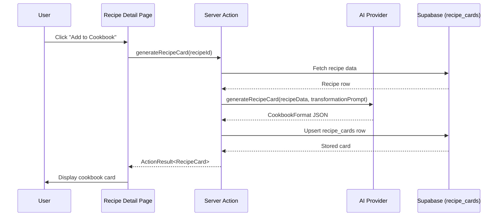
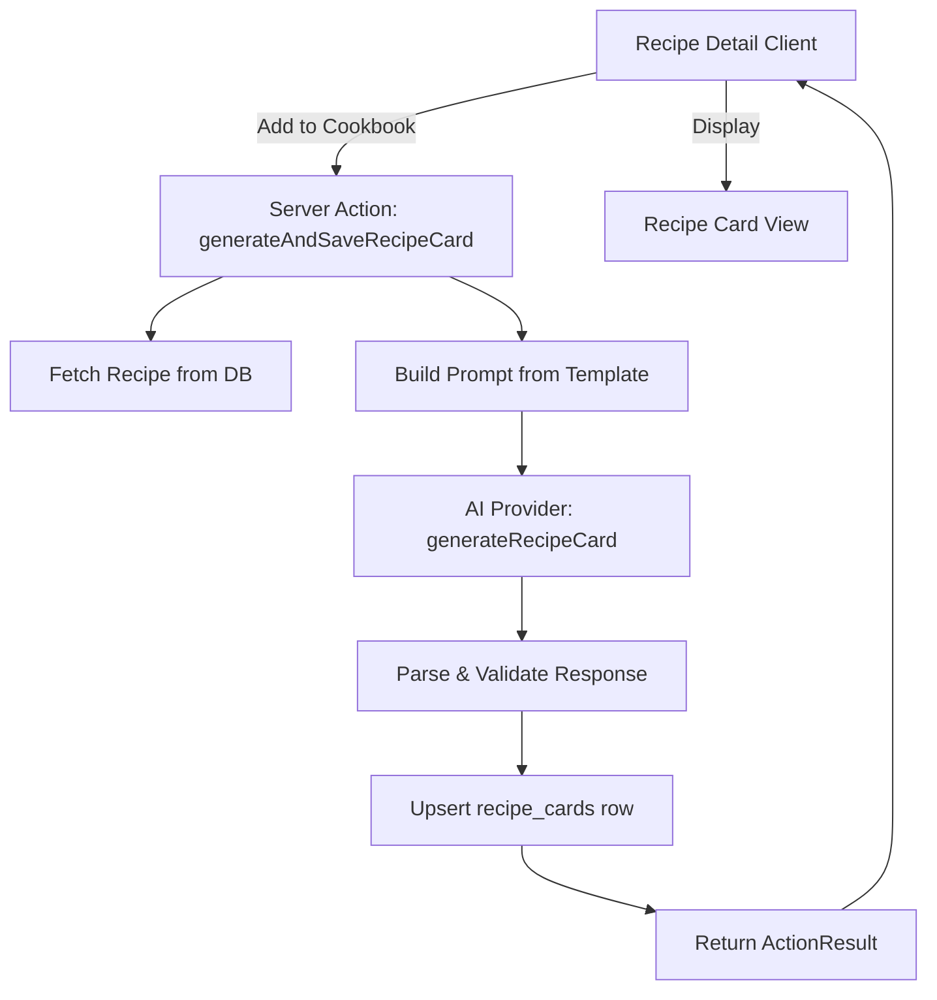

# Design Document: Recipe Card

## Overview

The Recipe Card feature transforms a full MISE recipe into a simplified, cookbook-style page via AI. Users explicitly trigger this via an "Add to Cookbook" button on the recipe detail page. The generated card is stored in a dedicated `recipe_cards` table, decoupled from the recipe's version history. When a recipe evolves via The Dial, the existing card is preserved — the user must explicitly regenerate it.

The core flow:
1. User clicks "Add to Cookbook" on the recipe detail page
2. A server action serializes the Recipe data and sends it to the AI provider with a transformation prompt
3. The AI returns a structured 6-block cookbook format (metadata, title, headnote, ingredients, method, plating)
4. The result is stored in `recipe_cards` and displayed on the recipe detail page



## Architecture

The feature follows the existing patterns in the codebase:

- **Server Action** (`library/actions.ts`): A new `generateAndSaveRecipeCard` action handles the full flow — fetch recipe, call AI, store result. This follows the existing `ActionResult<T>` pattern used by `saveRecipe`, `addDevNotes`, etc.
- **AI Provider Interface** (`ai-provider/types.ts`): A new `generateRecipeCard` method is added to the `AIProvider` interface. It accepts serialized recipe data and the transformation prompt, returns a non-streaming response with the cookbook format content.
- **Transformation Prompt** (`lib/recipe-card-prompt.ts`): The detailed prompt is stored as a constant/template. It's a pure function that takes a serialized Recipe and returns the system prompt + user message pair.
- **Database**: A new `recipe_cards` table with a foreign key to `recipes.id` and `users.id`.
- **UI**: The recipe detail client component gets an "Add to Cookbook" button in the side panel and a display area for the generated card content.



### Key Design Decisions

1. **Upsert, not insert**: When a user clicks "Add to Cookbook" on a recipe that already has a card, we replace the existing card content. This keeps the table clean (one card per recipe) and matches the requirement that regeneration replaces the previous card.

2. **Non-streaming response**: Unlike `generateRecipe` which streams, `generateRecipeCard` returns a complete response. The cookbook card is much shorter than a full recipe, so streaming adds complexity without meaningful UX benefit.

3. **Prompt as a constant module**: The transformation prompt is extensive and specific. Storing it as a dedicated module (`recipe-card-prompt.ts`) keeps it maintainable and testable independently of the AI provider.

4. **Structured JSON output**: The AI returns the cookbook format as structured JSON matching a `CookbookFormat` TypeScript interface. This allows typed rendering and validation, rather than raw markdown.

## Components and Interfaces

### New TypeScript Interfaces

```typescript
// src/lib/types/recipe-card.ts

/** The six blocks of the cookbook format */
export interface CookbookFormat {
  metadata: {
    sectionTag: string;    // e.g. "WEEKNIGHT: PASTA"
    serves: string;        // e.g. "Serves 4"
    context: string;       // e.g. "45 min · medium effort · autumn"
  };
  title: string;           // ALL CAPS recipe title
  headnote: string;        // 2-4 sentences, warm-but-precise chef tone
  ingredients: CookbookIngredient[];
  method: CookbookStep[];
  plating: {
    geometry: string;      // serving geometry description
    accompaniments: string[]; // from pairs_with data
  };
}

export interface CookbookIngredient {
  name: string;            // bold ingredient name
  quantity: string;        // metric-first, imperial in parens
  preparation: string;     // prep annotation, no rationale
}

export interface CookbookStep {
  number: number;
  instruction: string;     // 2-5 sentences per step
  donenessCue?: string;    // paired with timed actions
  warning?: string;        // inline warning for critical failure points
}

export interface RecipeCard {
  id: string;
  recipe_id: string;
  user_id: string;
  recipe_version: number;
  content: CookbookFormat;
  created_at: string;
  updated_at: string;
}
```

### AI Provider Interface Extension

```typescript
// Added to AIProvider interface in src/lib/ai-provider/types.ts

generateRecipeCard(
  recipeData: string,
  transformationPrompt: string
): Promise<string>;
```

Returns the raw JSON string of the `CookbookFormat`. The caller is responsible for parsing and validation. This keeps the AI provider interface simple and consistent — it deals in strings, not domain types.

### Server Action

```typescript
// Added to src/app/(studio)/library/actions.ts

export async function generateAndSaveRecipeCard(
  recipeId: string
): Promise<ActionResult<RecipeCard>>
```

This action:
1. Authenticates the user via `createClient()`
2. Fetches the recipe row from `recipes` table
3. Serializes the recipe data for the prompt
4. Calls `createAIProvider()` then `provider.generateRecipeCard()`
5. Parses and validates the response against `CookbookFormatSchema` (Zod)
6. Upserts into `recipe_cards` (insert on conflict update)
7. Returns the stored `RecipeCard`

### Fetch Existing Card Action

```typescript
export async function getRecipeCard(
  recipeId: string
): Promise<ActionResult<RecipeCard | null>>
```

Used by the recipe detail page to check if a card exists and display it.

### Transformation Prompt Module

```typescript
// src/lib/recipe-card-prompt.ts

export function buildRecipeCardPrompt(recipeJson: string): {
  systemPrompt: string;
  userMessage: string;
}
```

The system prompt contains the full transformation instructions (voice, format, stripping/preservation rules). The user message contains the serialized recipe JSON. The prompt constant `RECIPE_CARD_SYSTEM_PROMPT` is exported for testing.

### UI Components

The recipe detail client component (`recipe-detail-client.tsx`) is extended with:
- An "Add to Cookbook" button in the side panel (next to existing actions like Export, The Dial)
- A loading state while generation is in progress
- An error state with retry capability
- A card display section that renders the `CookbookFormat` blocks when a card exists
- A version mismatch indicator when the card was generated from an older recipe version

## Data Models

### `recipe_cards` Table Schema

| Column | Type | Constraints | Description |
|--------|------|-------------|-------------|
| `id` | `uuid` | PK, default `gen_random_uuid()` | Card identifier |
| `recipe_id` | `uuid` | FK → `recipes.id`, UNIQUE, NOT NULL | Source recipe |
| `user_id` | `uuid` | FK → `auth.users.id`, NOT NULL | Card owner |
| `recipe_version` | `integer` | NOT NULL | Recipe version used for generation |
| `content` | `jsonb` | NOT NULL | The `CookbookFormat` JSON |
| `created_at` | `timestamptz` | default `now()` | Creation timestamp |
| `updated_at` | `timestamptz` | default `now()` | Last update timestamp |

The `UNIQUE` constraint on `recipe_id` enforces one card per recipe. The upsert uses `ON CONFLICT (recipe_id) DO UPDATE`.

### Zod Validation Schema

```typescript
// Added to src/lib/zod-schemas.ts or in recipe-card-prompt.ts

export const CookbookIngredientSchema = z.object({
  name: z.string().min(1),
  quantity: z.string(),
  preparation: z.string(),
});

export const CookbookStepSchema = z.object({
  number: z.number().int().positive(),
  instruction: z.string().min(1),
  donenessCue: z.string().optional(),
  warning: z.string().optional(),
});

export const CookbookFormatSchema = z.object({
  metadata: z.object({
    sectionTag: z.string().min(1),
    serves: z.string().min(1),
    context: z.string().min(1),
  }),
  title: z.string().min(1),
  headnote: z.string().min(1),
  ingredients: z.array(CookbookIngredientSchema).min(1),
  method: z.array(CookbookStepSchema).min(1),
  plating: z.object({
    geometry: z.string(),
    accompaniments: z.array(z.string()),
  }),
});
```


## Correctness Properties

*A property is a characteristic or behavior that should hold true across all valid executions of a system — essentially, a formal statement about what the system should do. Properties serve as the bridge between human-readable specifications and machine-verifiable correctness guarantees.*

### Property 1: CookbookFormat storage round-trip

*For any* valid `CookbookFormat` object, storing it as JSONB in the `recipe_cards` table and then retrieving and parsing it should produce an object deeply equal to the original.

**Validates: Requirements 2.4**

### Property 2: Dial does not modify existing card

*For any* recipe that has an existing `RecipeCard`, and *for any* dial direction applied to that recipe, the `recipe_cards` row for that recipe should remain unchanged in both `content` and `updated_at` after the dial operation completes.

**Validates: Requirements 3.1**

### Property 3: Regeneration replaces card with current data

*For any* recipe that has an existing `RecipeCard`, when the user triggers "Add to Cookbook" again, the resulting card's `recipe_version` should equal the recipe's current version, and the card's `content` should differ from the previous card's content (assuming the recipe data changed between versions).

**Validates: Requirements 3.3**

### Property 4: Method steps are sequentially numbered

*For any* valid `CookbookFormat` object, the `method` array's step numbers should form a strictly sequential sequence starting from 1 (i.e., `method[i].number === i + 1` for all `i`).

**Validates: Requirements 4.7**

### Property 5: Rendered card output contains all six blocks

*For any* valid `CookbookFormat` object, the rendered output should contain distinct elements for all six blocks: page metadata, title, headnote, ingredient list, method steps, and plating/serving.

**Validates: Requirements 6.3**

## Error Handling

| Error Scenario | Handling Strategy | User-Facing Message |
|---|---|---|
| AI provider rate limit (429) | Return `AIProviderError` with `retryable: true`, show retry button | "Recipe card generation is temporarily unavailable. Please try again shortly." |
| AI provider auth failure (401/403) | Return `AIProviderError` with `retryable: false` | "An error occurred generating the recipe card. Please contact support." |
| AI provider timeout | Return `AIProviderError` with `retryable: true`, show retry button | "Recipe card generation timed out. Please try again." |
| AI returns invalid JSON / fails Zod validation | Return `ActionResult` with error, allow retry | "The generated recipe card had an unexpected format. Please try again." |
| Recipe not found | Return `ActionResult` with error | "Recipe not found." |
| User not authenticated | Return `ActionResult` with error | "You must be signed in to generate a recipe card." |
| Database upsert failure | Return `ActionResult` with error, allow retry | "Failed to save the recipe card. Please try again." |
| Recipe has no structured data (components empty) | Prevent action, disable button | Button disabled with tooltip: "Recipe needs structured data to generate a cookbook card." |

Error handling follows the existing `ActionResult<T>` pattern. AI errors are caught in the server action and mapped to user-friendly messages. The client component manages retry state locally.

## Testing Strategy

### Unit Tests

- **Transformation prompt module**: Verify `buildRecipeCardPrompt` returns a system prompt containing all required instructions (six blocks, stripping rules, preservation rules, doneness cue requirements, warning requirements). Verify the user message contains the serialized recipe JSON.
- **CookbookFormat Zod schema**: Verify valid objects pass, verify objects missing required fields fail, verify edge cases (empty arrays, missing optional fields).
- **Title uppercase check**: Example test that the prompt instructs ALL CAPS title.
- **Version mismatch logic**: Example test that `card.recipe_version < recipe.version` correctly identifies stale cards.
- **Error mapping**: Example tests for each API error status code mapping to the correct `AIProviderError`.

### Property-Based Tests

Property-based tests use `fast-check` (already available in the JS/TS ecosystem for Next.js projects). Each test runs a minimum of 100 iterations.

- **Property 1** (CookbookFormat round-trip): Generate arbitrary `CookbookFormat` objects via `fast-check` arbitraries, serialize to JSON, parse back, assert deep equality.
  - Tag: `Feature: recipe-card, Property 1: CookbookFormat storage round-trip`
- **Property 2** (Dial immutability): Generate a recipe card fixture, simulate dial operations with random directions, assert card row is unchanged.
  - Tag: `Feature: recipe-card, Property 2: Dial does not modify existing card`
- **Property 3** (Regeneration replaces): Generate two different recipe versions, create a card from v1, regenerate from v2, assert card reflects v2.
  - Tag: `Feature: recipe-card, Property 3: Regeneration replaces card with current data`
- **Property 4** (Sequential steps): Generate arrays of `CookbookStep` with random content, assert step numbers are sequential from 1.
  - Tag: `Feature: recipe-card, Property 4: Method steps are sequentially numbered`
- **Property 5** (All blocks rendered): Generate arbitrary valid `CookbookFormat` objects, pass through the render function, assert all six block identifiers are present in the output.
  - Tag: `Feature: recipe-card, Property 5: Rendered card output contains all six blocks`

### Integration Tests

- **End-to-end card generation**: Mock the AI provider, call `generateAndSaveRecipeCard`, verify the `recipe_cards` row is created with correct foreign keys and content.
- **Upsert behavior**: Create a card, call `generateAndSaveRecipeCard` again, verify the row is updated (not duplicated).
- **Auth guard**: Call the server action without authentication, verify it returns an auth error.
- **getRecipeCard**: Verify it returns `null` when no card exists, and returns the card when one does.
