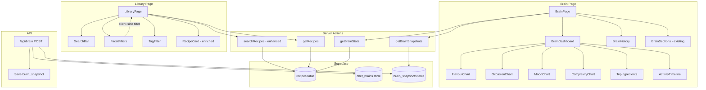

# Design Document: Recipe Library Enhancements

## Overview

This design covers five interconnected enhancements to the MISE recipe library and Brain page:

1. **Enriched Recipe Cards** — Surface intent metadata (occasion, mood, effort, time, feeds, dietary) and flavour info (dominant_element, ingredient count) on library cards so cooks can identify recipes at a glance.
2. **Category/Facet Filtering** — Add client-side filter controls for occasion, mood, effort, season, dietary, and dominant_element that work alongside existing tag filtering.
3. **Deep Multi-Field Search** — Extend the server-side `searchRecipes` action to query across title, ingredient names, tags, intent fields, flavour fields, and dietary restrictions with relevance-ranked results.
4. **Brain Visual Dashboard** — Replace the raw-text-only Brain page with visual charts showing flavour preferences, occasion/mood/complexity distributions, top ingredients, and cooking activity timeline, computed from the recipes table.
5. **Brain History** — Store brain snapshots on each compilation, display a version list, allow viewing previous snapshots, and show a diff between current and previous versions.

The existing editorial design system (`--ed-*` CSS custom properties, inline styles, no border-radius/shadows) is preserved throughout. All new UI components use the same patterns as the current library page and editorial components.

## Architecture



### Key Design Decisions

**Client-side facet filtering**: Facet filters (occasion, mood, effort, season, dietary, dominant_element) operate on the already-loaded recipe set in memory. Rationale: the library already loads all user recipes via `getRecipes()`, and typical user libraries are small enough (< 500 recipes) that client-side filtering is instant and avoids extra round-trips. The existing tag filter already works this way.

**Server-side deep search**: The enhanced search uses Supabase `ilike` queries across multiple JSONB fields. When a search query is active, the server returns a pre-filtered set. Facet filters then apply client-side on top of search results.

**SVG-based charts (no charting library)**: The Brain dashboard uses simple inline SVG bar charts and a CSS grid heatmap rather than adding a charting dependency like recharts or chart.js. The data is simple categorical distributions with small cardinalities (6-8 categories max). This keeps the bundle small and matches the editorial aesthetic.

**Brain snapshots table**: A new `brain_snapshots` table stores each compiled version. The existing `chef_brains` table continues to hold the current version. On each POST to `/api/brain`, the compiled result is also inserted into `brain_snapshots`. This is append-only and lightweight.

## Components and Interfaces

### Enriched Recipe Card (modified)

The existing recipe card in `library/page.tsx` is enhanced inline (no separate component extraction needed). New metadata rows are added below the title.

```typescript
// Data extracted from RecipeRow for card display
interface CardMetadata {
  occasion: string;        // from intent.occasion
  mood: string;            // from intent.mood
  effort: string;          // from intent.effort
  totalTime: number;       // from intent.total_time_minutes
  feeds: number;           // from intent.feeds
  dietary: string[];       // from intent.dietary
  dominantElement: string; // from flavour.dominant_element
  ingredientCount: number; // computed from components[].ingredients[]
}
```

### Facet Filter Controls (new)

```typescript
interface FacetFilters {
  occasion: string | null;
  mood: string | null;
  effort: string | null;
  season: string | null;
  dietary: string | null;
  dominantElement: string | null;
}

// Filter options derived from loaded recipes
interface FilterOptions {
  occasions: string[];
  moods: string[];
  efforts: string[];
  seasons: string[];
  dietaryTags: string[];
  dominantElements: string[];
}
```

Filter controls render as horizontal rows of text buttons (matching the existing tag filter pattern — plain text with interpunct separators, bold when active). Each facet row has an "All" option that clears that facet. Multiple facets combine with AND logic.

### Enhanced Search Action (modified)

```typescript
// Enhanced searchRecipes signature (unchanged externally)
export async function searchRecipes(
  userId: string | undefined,
  query: string
): Promise<ActionResult<RecipeRow[]>>
```

Internally, the search builds a Supabase query that checks:
- `title ilike %query%`
- `intent->>'occasion' ilike %query%`
- `intent->>'mood' ilike %query%`
- `intent->>'season' ilike %query%`
- `intent->>'effort' ilike %query%`
- `flavour->>'dominant_element' ilike %query%`
- `tags` array contains query (case-insensitive)
- `intent->>'dietary'` text search

For ingredient search, since ingredients are nested in JSONB (`components[].ingredients[].name`), we use a Supabase RPC function or a raw `textSearch` approach. The simplest approach: fetch all user recipes and filter client-side for ingredient matches when the server-side title/intent/flavour query returns results. Alternatively, create a Postgres function for deep JSONB search.

**Chosen approach**: A two-pass strategy:
1. Server-side: query title, intent fields, flavour fields, and tags via Supabase JSONB operators
2. Client-side: additionally filter the full recipe set for ingredient name matches and merge results, deduplicating by ID, with title matches ranked first

### Brain Stats Action (new)

```typescript
interface BrainStats {
  flavourDistribution: Record<string, number>;    // dominant_element -> count
  occasionDistribution: Record<string, number>;   // occasion -> count
  moodDistribution: Record<string, number>;       // mood -> count
  complexityDistribution: Record<string, number>; // complexity_mode -> count
  topIngredients: Array<{ name: string; count: number }>; // top 15
  activityTimeline: Array<{ date: string; count: number }>; // recipes per month
  totalRecipes: number;
}

export async function getBrainStats(): Promise<ActionResult<BrainStats>>
```

This server action fetches all user recipes and computes distributions in-memory. The data volume is small (user's own recipes) and the computation is trivial.

### Brain Snapshots (new)

```typescript
interface BrainSnapshot {
  id: string;
  userId: string;
  version: number;
  promptText: string;
  compiledAt: string;
}

export async function getBrainSnapshots(): Promise<ActionResult<BrainSnapshot[]>>
```

### Brain Dashboard Components (new)

```typescript
// Simple bar chart using inline SVG
interface BarChartProps {
  data: Record<string, number>;
  label: string;
  accentColor?: string;
}

// Top ingredients list
interface TopIngredientsProps {
  ingredients: Array<{ name: string; count: number }>;
}

// Activity heatmap/timeline
interface ActivityTimelineProps {
  data: Array<{ date: string; count: number }>;
}

// Snapshot diff viewer
interface BrainDiffProps {
  current: string;
  previous: string;
}
```


## Data Models

### Existing: `recipes` table (no schema changes)

The recipes table already stores all needed data in JSONB columns:
- `intent` — contains occasion, mood, season, effort, feeds, total_time_minutes, dietary
- `flavour` — contains dominant_element, flavour_profile
- `components` — contains nested ingredients with name fields
- `tags` — text array
- `title` — text
- `complexity_mode` — text
- `created_at`, `updated_at` — timestamps

No schema migration is needed for requirements 1-4. All data is already persisted; we just need to read and display it.

### New: `brain_snapshots` table

```sql
CREATE TABLE brain_snapshots (
  id UUID PRIMARY KEY DEFAULT gen_random_uuid(),
  user_id UUID NOT NULL REFERENCES auth.users(id) ON DELETE CASCADE,
  version INTEGER NOT NULL,
  prompt_text TEXT NOT NULL,
  compiled_at TIMESTAMPTZ NOT NULL DEFAULT now(),
  created_at TIMESTAMPTZ NOT NULL DEFAULT now()
);

CREATE INDEX idx_brain_snapshots_user_id ON brain_snapshots(user_id);
CREATE INDEX idx_brain_snapshots_user_version ON brain_snapshots(user_id, version DESC);

-- RLS policies
ALTER TABLE brain_snapshots ENABLE ROW LEVEL SECURITY;

CREATE POLICY "Users can read own snapshots"
  ON brain_snapshots FOR SELECT
  USING (auth.uid() = user_id);

CREATE POLICY "Service role can insert snapshots"
  ON brain_snapshots FOR INSERT
  WITH CHECK (true);
```

Each row captures one compilation event. The `version` field matches `chef_brains.version` at the time of compilation. Rows are append-only — never updated or deleted by the application.

### Zod Validation Schemas

```typescript
import { z } from 'zod';

// Facet filter input validation
const FacetFiltersSchema = z.object({
  occasion: z.string().nullable(),
  mood: z.string().nullable(),
  effort: z.string().nullable(),
  season: z.string().nullable(),
  dietary: z.string().nullable(),
  dominantElement: z.string().nullable(),
});

// Search query validation
const SearchQuerySchema = z.string().max(200).trim();

// Brain snapshot row
const BrainSnapshotSchema = z.object({
  id: z.string().uuid(),
  user_id: z.string().uuid(),
  version: z.number().int().positive(),
  prompt_text: z.string(),
  compiled_at: z.string().datetime(),
});
```

### Search Relevance Ranking

Results are ranked by match location:
1. **Title match** — highest priority (direct `ilike` on title)
2. **Tag match** — second priority (array containment)
3. **Intent field match** — third priority (occasion, mood, season, effort, dietary)
4. **Flavour field match** — fourth priority (dominant_element, flavour_profile)
5. **Ingredient match** — fifth priority (client-side scan of component ingredients)

The implementation assigns a numeric score per recipe based on which fields matched, then sorts descending. Title matches always float to the top.

### Brain Stats Computation

Stats are computed from the full recipe set in a single server action call:

```typescript
// Pseudocode for getBrainStats
const recipes = await getAllUserRecipes(userId);

const stats: BrainStats = {
  flavourDistribution: countBy(recipes, r => r.flavour?.dominant_element),
  occasionDistribution: countBy(recipes, r => r.intent?.occasion),
  moodDistribution: countBy(recipes, r => r.intent?.mood),
  complexityDistribution: countBy(recipes, r => r.complexity_mode),
  topIngredients: getTopIngredients(recipes, 15),
  activityTimeline: groupByMonth(recipes, r => r.created_at),
  totalRecipes: recipes.length,
};
```

The `getTopIngredients` function flattens all `components[].ingredients[].name` across all recipes, counts occurrences, and returns the top 15 sorted by frequency.


## Correctness Properties

*A property is a characteristic or behavior that should hold true across all valid executions of a system — essentially, a formal statement about what the system should do. Properties serve as the bridge between human-readable specifications and machine-verifiable correctness guarantees.*

### Property 1: Card metadata extraction preserves all intent and flavour fields

*For any* recipe with valid intent and flavour JSONB data, the card metadata extraction function should return an object where `occasion` equals `intent.occasion`, `mood` equals `intent.mood`, `effort` equals `intent.effort`, `totalTime` equals `intent.total_time_minutes`, `feeds` equals `intent.feeds`, `dietary` equals `intent.dietary`, and `dominantElement` equals `flavour.dominant_element`.

**Validates: Requirements 1.1, 1.2, 1.3, 1.4, 1.5, 1.7, 1.8**

### Property 2: Duration formatting round-trip

*For any* non-negative integer representing minutes, the `formatDuration` function should produce a human-readable string, and parsing that string back should yield the original number of minutes. Additionally, values under 60 should produce a string containing "min", and values of 60 or above should contain "h".

**Validates: Requirements 1.4**

### Property 3: Unique ingredient count accuracy

*For any* recipe with an arbitrary number of components each containing an arbitrary number of ingredients (including duplicate names across components), the computed ingredient count should equal the size of the set of unique ingredient names across all components.

**Validates: Requirements 1.6**

### Property 4: Facet filter correctness

*For any* set of recipes and any combination of facet filter values (occasion, mood, effort, season, dietary, dominantElement — each either null or a valid value), every recipe in the filtered result should match ALL non-null filter values, and every recipe excluded from the result should fail to match at least one non-null filter value. When all filter values are null, the result should equal the full input set.

**Validates: Requirements 2.3, 2.4**

### Property 5: Multi-field search recall

*For any* recipe and any non-empty substring taken from one of its searchable fields (title, ingredient names, tags, occasion, mood, season, effort, dominant_element, flavour_profile tags, dietary), using that substring as a case-insensitive search query should include that recipe in the results.

**Validates: Requirements 3.1, 3.2, 3.3, 3.4, 3.5, 3.6, 3.9**

### Property 6: Search relevance ordering

*For any* search result set containing at least one title-matched recipe and at least one non-title-only-matched recipe, all title-matched recipes should appear before all non-title-only-matched recipes in the result ordering.

**Validates: Requirements 3.7**

### Property 7: Distribution computation correctness

*For any* set of recipes and any categorical field accessor (occasion, mood, effort, dominant_element, complexity_mode), the computed distribution should have values that sum to the number of recipes with a non-null value for that field, and each category's count should equal the actual number of recipes with that category value.

**Validates: Requirements 4.1, 4.2, 4.3, 4.4**

### Property 8: Top ingredients ranking and limit

*For any* set of recipes, the top ingredients list should: (a) contain at most 15 items, (b) be sorted by frequency in descending order, (c) have each item's count equal to the actual number of recipes containing that ingredient name, and (d) not omit any ingredient that has a higher count than any included ingredient.

**Validates: Requirements 4.5**

### Property 9: Activity timeline completeness

*For any* set of recipes, the activity timeline entries' counts should sum to the total number of recipes, and each entry's count should equal the number of recipes whose `created_at` falls within that time period.

**Validates: Requirements 4.6**

### Property 10: Brain diff completeness

*For any* two non-empty strings representing brain prompt versions, the diff output should contain every line from both inputs, with each line correctly classified as added (present only in new), removed (present only in old), or unchanged (present in both).

**Validates: Requirements 5.4**

## Error Handling

### Search Errors

- If the enhanced `searchRecipes` server action fails on the multi-field query, fall back to the existing title-only `ilike` search (matching current behavior).
- If the client-side ingredient search throws (malformed JSONB data), catch and return the server-side results only, logging the error.
- Empty or whitespace-only search queries return the full recipe set (no error).

### Facet Filter Errors

- Facet filters operate on in-memory data, so failures are unlikely. If a recipe has missing/null intent or flavour fields, the filter treats missing values as non-matching (recipe is excluded when that facet is active).
- Malformed JSONB in intent or flavour fields is handled by optional chaining — the recipe simply won't match any facet filter for that field.

### Brain Stats Errors

- If `getBrainStats` fails to fetch recipes, return an error message and display the existing brain prompt text sections as a fallback.
- If individual stat computations encounter malformed data (e.g., missing `intent` on a recipe), skip that recipe for that computation rather than failing entirely.

### Brain Snapshot Errors

- Per requirement 5.5: if saving a brain snapshot fails, log the error and continue returning the compiled brain normally. The snapshot save is wrapped in a try/catch that does not propagate errors.
- If `getBrainSnapshots` fails, display the current brain version without the history panel, with a subtle error message.
- If a selected snapshot has corrupted or empty `prompt_text`, display a "Snapshot data unavailable" message.

### Brain Diff Errors

- If either the current or previous brain text is empty/null, skip the diff view and show only the current version.
- If the diff computation fails (extremely long texts), catch and display "Unable to compute comparison" with both texts shown side-by-side as plain text.

## Testing Strategy

### Unit Tests (Vitest)

Unit tests cover specific examples and edge cases:

- **Duration formatting**: Test specific values (0, 1, 30, 59, 60, 90, 120, 1440) for expected output strings.
- **Card metadata extraction**: Test with a complete recipe, a recipe with missing intent, a recipe with missing flavour.
- **Ingredient count**: Test with zero components, one component with no ingredients, duplicate ingredient names across components.
- **Facet filter**: Test AND logic with multiple active filters, test with recipes missing fields.
- **Search**: Test empty query returns all, test case-insensitive matching, test no-match returns empty.
- **Brain stats**: Test with zero recipes (empty distributions), test with one recipe, test top ingredients limit of 15.
- **Brain diff**: Test identical strings (no changes), test completely different strings, test empty inputs.

### Property-Based Tests (fast-check)

The project already has `fast-check` as a dev dependency. Each correctness property maps to a property-based test with minimum 100 iterations.

- **Property 1**: Generate random recipe objects with arbitrary intent/flavour fields, verify extraction.
- **Property 2**: Generate random non-negative integers, verify formatDuration round-trip.
- **Property 3**: Generate random arrays of components with random ingredient lists, verify unique count.
- **Property 4**: Generate random recipe arrays and random filter combinations, verify filter correctness.
- **Property 5**: Generate random recipes, pick a random searchable field value as query, verify recall.
- **Property 6**: Generate result sets with known title/non-title matches, verify ordering.
- **Property 7**: Generate random recipe arrays, verify distribution sums and per-category counts.
- **Property 8**: Generate random recipe arrays with random ingredients, verify top-15 ranking.
- **Property 9**: Generate random recipe arrays with random created_at dates, verify timeline sums.
- **Property 10**: Generate random string pairs, verify diff completeness.

Each test is tagged with: `Feature: recipe-library-enhancements, Property {N}: {title}`

Configuration: `fc.assert(fc.property(...), { numRuns: 100 })`

### Integration Tests

- **Brain snapshot persistence**: Trigger a brain compilation via POST `/api/brain` and verify a row was inserted into `brain_snapshots`.
- **Search with Supabase**: Test the server-side search action against a seeded test database with known recipes.
- **Brain stats with real data**: Test `getBrainStats` against a seeded test database.

### Manual Testing

- Visual verification of enriched recipe cards across different recipe types (minimal data, full data, missing fields).
- Visual verification of chart rendering in the Brain dashboard.
- Responsive layout testing for filter controls and dashboard charts.
- Accessibility review of filter controls (keyboard navigation, screen reader labels).
