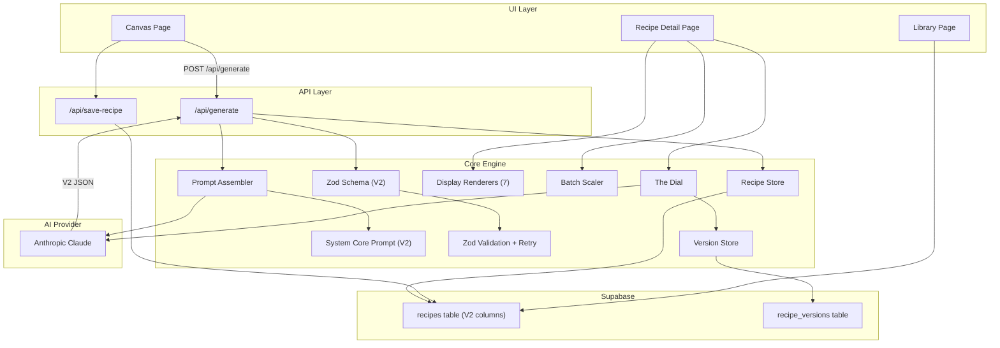

# Design Document: Recipe Model V2 Migration

## Overview

MISE is a culinary development engine built on Next.js 14 App Router with Supabase and Anthropic API. The V2 recipe data model has been defined as TypeScript interfaces in `src/lib/types/recipe.ts` but the rest of the codebase still operates on V1 shapes at runtime. This migration rewires every layer — Zod validation, system core prompt, database schema, generation API, recipe persistence, display renderers, batch scaler, The Dial, and all UI pages — to produce, validate, store, and render V2 recipes.

The V2 model introduces structured flavour architecture (acid/fat/heat/sweetness/umami profiles), component IDs with prep-ahead windows, steps with doneness cues and recovery paths, a timeline with critical path and parallel support, scaling metadata, restructured variations (dietary/taste_profiles/technique/regional), relationships, shopping lists, development logs, and recipe meta. Version lineage is tracked via `parent_id` and `root_id`.

The migration is a single coordinated cut-over: once the Zod schema validates V2, the system core prompt instructs Claude to emit V2 JSON, the generation API saves V2 to the database, and all renderers/scalers/dial consume V2 shapes. No V1/V2 dual-mode is needed because existing saved recipes will continue to live in their JSONB columns (Postgres is schema-on-read for JSONB), and the renderers will be updated to read V2 property names.

## Architecture



## Sequence Diagrams

### Recipe Generation Flow (V2)

```mermaid
sequenceDiagram
    participant U as Canvas Page
    participant G as /api/generate
    participant PA as Prompt Assembler
    participant SC as System Core (V2)
    participant AI as Claude
    participant Z as Zod V2 Schema
    participant RS as Recipe Store
    participant DB as Supabase

    U->>G: POST { dishDescription, fingerprintId, ... }
    G->>PA: assemblePrompt(userId, fpId, ctx, mode)
    PA->>SC: getSystemCore() — V2 JSON instructions
    PA-->>G: AssembledPrompt (system + user)
    G->>AI: generateRecipe(systemPrompt, userMessage)
    AI-->>G: V2 Recipe JSON string
    G->>Z: parseAndValidate(rawJSON)
    alt Valid V2
        Z-->>G: { success: true, recipe }
        G->>RS: storeRecipeWithSnapshot(recipe, snapshot, userId)
        RS->>DB: INSERT into recipes (V2 columns)
        DB-->>RS: { id }
        G-->>U: { recipe, id }
    else Invalid
        Z-->>G: { success: false, errors }
        G->>AI: retry with correction prompt (up to 2x)
        AI-->>G: corrected JSON
        G->>Z: re-validate
    end
